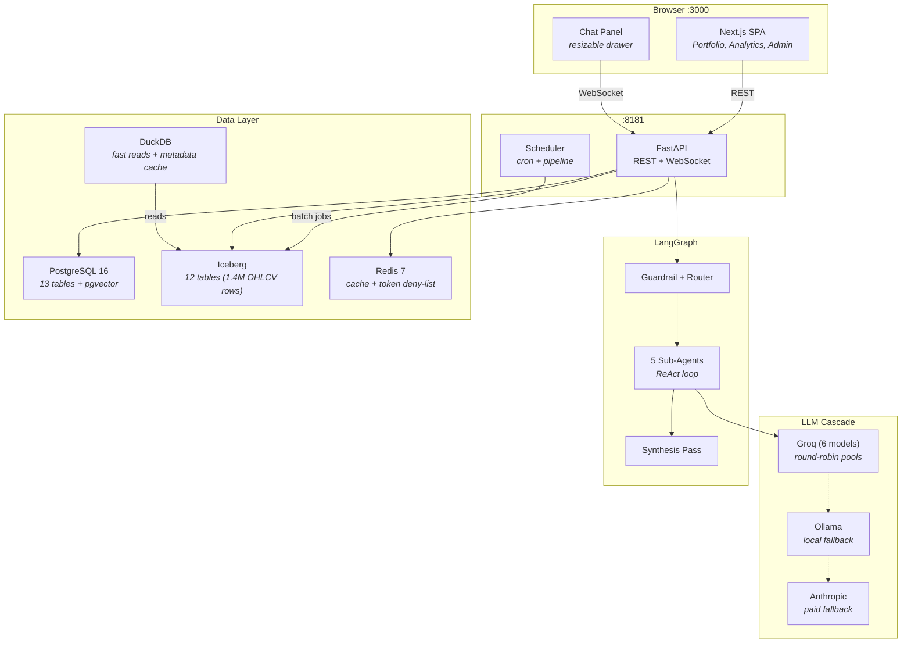

# AI Agent UI

A fullstack agentic chat application with stock analysis, Prophet forecasting, and portfolio management. LangChain ReAct agents with memory-augmented multi-turn conversations. Hybrid PostgreSQL + Apache Iceberg data layer with DuckDB read acceleration. Automated pipeline orchestration for 752 stocks across India and US markets.

---

## Features

- **5 AI sub-agents** — Portfolio, Stock Analyst, Forecaster, Research, Sentiment (LangGraph supervisor routing)
- **Memory-augmented chat** — pgvector semantic memory (768-dim), per-user facts + rolling summary
- **Round-robin LLM pools** — 6 Groq models (~2.3M TPD), Ollama local fallback, Anthropic paid tier
- **Prophet forecasting** — 3/6/9-month targets, 80% confidence bands, XGBoost ensemble correction, backtest overlay
- **Portfolio dashboard** — TradingView charts, sector allocation, P&L trend, news sentiment, recommendations
- **Piotroski F-Score** — fundamental scoring (747 stocks), market filter (India/US)
- **Sentiment scoring** — LLM headline analysis, hot/learning/cold tiers, market fallback
- **Pipeline orchestration** — 4-step pipelines (Data Refresh → Analytics → Sentiment → Piotroski), force run, DAG viz
- **Scheduler** — cron jobs with freshness gates, CV reuse (30-day TTL), catchup on restart
- **Data Health dashboard** — 5 health cards with fix buttons, NaN cleanup, backfill from yfinance
- **Insights screener** — 752 stocks with sentiment, RSI, MACD, Sharpe, tag/index filters (Nifty 50/100/500, cap sizes)
- **Dual payment gateways** — Razorpay (INR) + Stripe (USD)
- **Docker Compose** — 5 services, single command start
- **19 CLI pipeline commands** — seed, download, analytics, sentiment, forecast, screen, refresh

---

## Services

| Service | Stack | Port |
|---------|-------|------|
| **Frontend** | Next.js 16 + React 19 + Tailwind 4 + lightweight-charts v5 | 3000 |
| **Backend** | FastAPI + LangChain 1.2 + SQLAlchemy 2.0 async | 8181 |
| **PostgreSQL** | pgvector:pg16 (13 OLTP tables + pgvector) | 5432 |
| **Redis** | Redis 7 Alpine | 6379 |
| **Docs** | MkDocs Material 9 | 8000 |

---

## Quick Start

```bash
git clone git@github.com:asequitytrading-design/ai-agent-ui.git
cd ai-agent-ui
cp .env.example .env                    # fill in API keys
docker compose up -d                    # start all 5 services
docker compose exec backend python scripts/seed_demo_data.py
```

Open [http://localhost:3000](http://localhost:3000) — login: `admin@demo.com` / `Admin123!`

### Alternative: Native Setup

```bash
./setup.sh                              # interactive installer
./run.sh start                          # start all services
```

| Flag | Purpose |
|------|---------|
| `--non-interactive` | Read secrets from env vars (CI/Docker) |
| `--force` | Reset state and re-run everything |
| `--repair` | Fix symlinks, env files, git hooks only |

### Platform Guides

- [macOS](http://localhost:8000/setup/macos/) — Homebrew, pyenv, Node.js
- [Linux](http://localhost:8000/setup/linux/) — apt, pyenv, nvm
- [Windows](http://localhost:8000/setup/windows/) — WSL2 + Ubuntu

---

## Architecture



---

## Database

### PostgreSQL (13 tables — OLTP, row-level CRUD)

| Table | Purpose |
|-------|---------|
| `auth.users` | User accounts (bcrypt, RBAC) |
| `auth.user_tickers` | Portfolio/watchlist links |
| `auth.payment_transactions` | Razorpay/Stripe ledger |
| `public.user_memories` | pgvector semantic memory (768-dim) |
| `stocks.registry` | Ticker registry (yf_ticker, market) |
| `stocks.scheduled_jobs` | Cron job definitions (force flag) |
| `stocks.scheduler_runs` | Execution records (status, progress) |
| `stock_master` | Pipeline universe (symbol, ISIN, yf_ticker) |
| `stock_tags` | Temporal tags (nifty50, largecap, etc.) |
| `ingestion_cursor` | Keyset pagination cursor |
| `ingestion_skipped` | Failed ticker log + retry |
| `pipelines` | Pipeline chain definitions |
| `pipeline_steps` | Ordered steps within pipelines |

### Iceberg (12 tables — OLAP, append-only analytics)

`ohlcv` (1.4M rows), `company_info`, `dividends`, `quarterly_results`,
`analysis_summary`, `forecast_runs`, `forecasts`, `piotroski_scores`,
`sentiment_scores`, `llm_pricing`, `llm_usage`, `portfolio_transactions`

DuckDB serves as the primary read engine with in-memory metadata cache.

---

## Scheduler & Pipeline

### Job Types with Freshness Gates

| Job | Freshness | Skip if... | Cadence |
|-----|-----------|-----------|---------|
| Data Refresh | OHLCV latest date | `>= yesterday` | Daily |
| Compute Analytics | analysis_summary | computed today | Daily |
| Sentiment Scoring | scored_at | scored today | Daily |
| Forecasts | forecast run_date | `< 7 days old` | Weekly |
| Forecast CV | accuracy metrics | `< 30 days old` | Monthly (auto) |
| Piotroski F-Score | none | always recomputes | Monthly |

### Pipeline (India Daily — 4 steps, ~10 min)

```
Data Refresh → Compute Analytics → Sentiment → Piotroski
  (5 min)         (45s)            (3.5 min)     (2s)
```

### Performance

| Optimization | Before | After |
|-------------|--------|-------|
| OHLCV batch load (748 tickers) | 167s | 0.87s |
| Freshness check | 329s | 0.44s |
| Forecast writes | 11.5 min | ~2s |
| Progress updates | 9s/call | 14ms/call |
| Weekly forecast (748 tickers) | ~33 min | ~8 min |

Workers: `cpu_count // 2`. Prophet CV: `parallel=None` (no nested processes).

---

## Frontend Pages

| Page | Route | Features |
|------|-------|----------|
| Portfolio | `/dashboard` | Hero stats, sector allocation, P&L, news, forecast |
| Analytics Home | `/analytics` | Stock cards, search, bulk actions |
| Stock Analysis | `/analytics/analysis` | Candlestick + indicators, forecast chart, compare |
| Insights | `/analytics/insights` | Screener (752 stocks), Risk, Sectors, Targets, Dividends, Correlation, Quarterly, Piotroski |
| Admin | `/admin` | Users, Audit, LLM Observability, Maintenance, Transactions, Scheduler |
| Docs | `/docs` | MkDocs Material embed |

All tabbed pages persist active tab in URL (`?tab=scheduler`).

---

## Stock Data Pipeline (CLI)

```bash
PYTHONPATH=.:backend python -m backend.pipeline.runner <command>
```

| Command | Description |
|---------|-------------|
| `download` | Fetch Nifty 500 CSV from NSE |
| `seed --csv ...` | Seed stock_master universe |
| `bulk-download` | Batch yfinance OHLCV (all tickers) |
| `fill-gaps` | Patch company_info gaps |
| `status` | Check cursor progress |
| `analytics --scope india` | Compute analysis summary |
| `sentiment --scope india` | LLM headline scoring |
| `forecast --scope india [--force]` | Prophet forecasts |
| `screen` | Piotroski F-Score |
| `indices` | Refresh market indices |
| `refresh --scope india --force` | Full pipeline chain |

---

## LLM Cascade

```
Tool Pool:    llama-3.3-70b → kimi-k2 → qwen3-32b  (round-robin)
Quality Pool: gpt-oss-120b → gpt-oss-20b             (round-robin)
Fast Pool:    scout-17b                               (single)
Local:        Ollama gpt-oss:20b                      (fallback)
Paid:         Anthropic claude-sonnet-4-6              (final fallback)
```

Progressive compression: system prompt → tool results → context window.

---

## Auth Flow

JWT access tokens (60 min) + HttpOnly refresh cookies (7 days).
Token deny-list in Redis. OAuth PKCE for Google SSO.

```
POST /auth/login → {access_token} + HttpOnly cookie
POST /auth/refresh → rotated tokens
```

---

## Testing

```bash
python -m pytest tests/ -v              # 755 backend tests
cd frontend && npx vitest run           # 18 frontend tests
cd e2e && npm test                      # 219 E2E tests (needs live services)
```

---

## Development

```bash
./run.sh start                          # all services
./run.sh rebuild backend                # rebuild after code changes
./run.sh rebuild frontend               # rebuild frontend
./run.sh logs backend -f                # follow logs
./run.sh status                         # health check
./run.sh doctor                         # diagnostics
docker compose exec redis redis-cli FLUSHALL  # clear cache
```

---

## Documentation

Full docs at [http://localhost:8000](http://localhost:8000):

- [Scheduler & Pipelines](http://localhost:8000/stock_agent/scheduler/)
- [Maintenance & Data Health](http://localhost:8000/stock_agent/maintenance/)
- [Data Pipeline](http://localhost:8000/stock_agent/data-pipeline/)
- [API Reference](http://localhost:8000/backend/api/)
- [Auth & Users](http://localhost:8000/backend/auth/)

---

## License

Private repository. All rights reserved.
