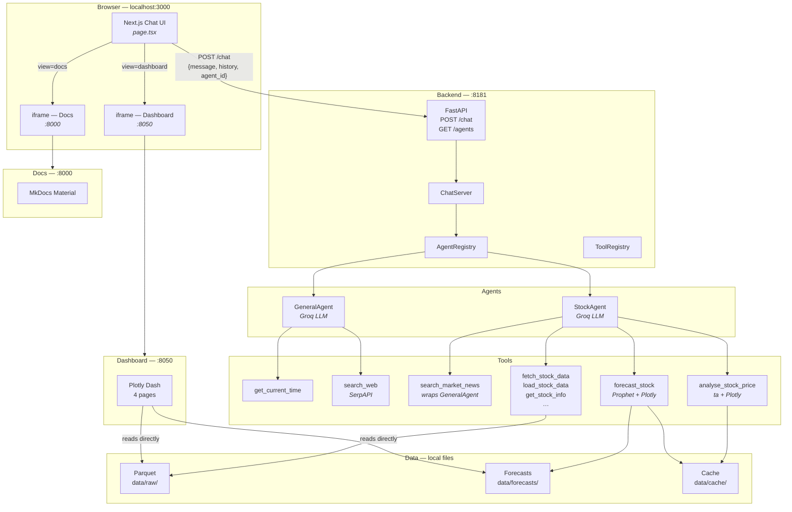
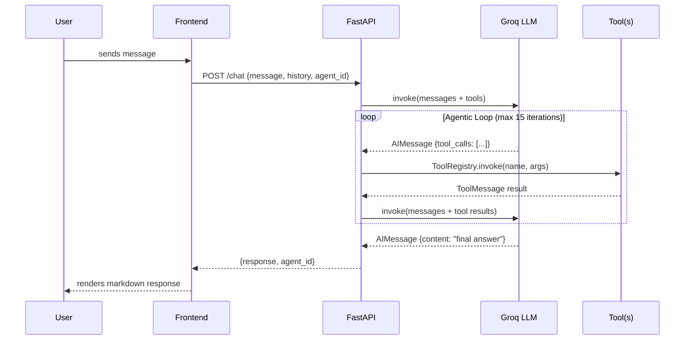
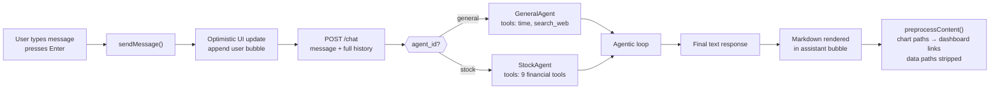
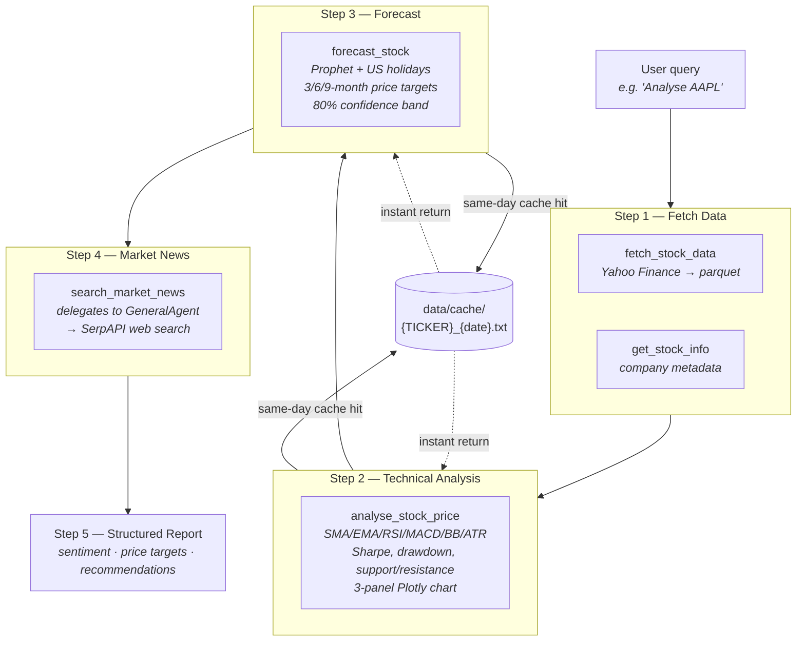
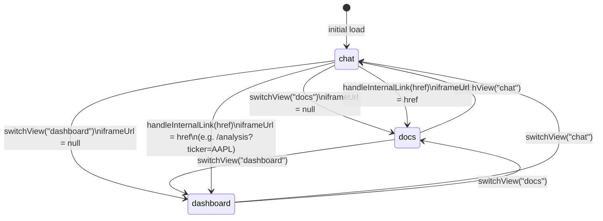
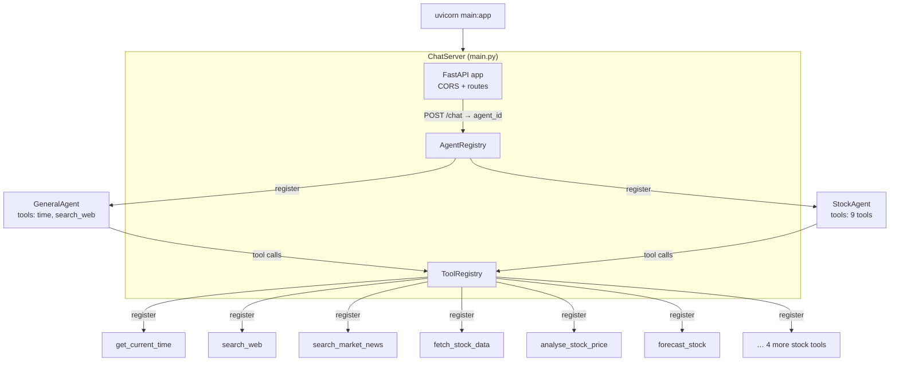

# AI Agent UI

A fullstack agentic chat application powered by LangChain, FastAPI, and Next.js. The backend runs an LLM in a tool-calling loop; the frontend is a single-page app that embeds the Docs and Dashboard in-context alongside the chat interface.

---

## Services at a Glance

| Service | Stack | Port | Purpose |
|---------|-------|------|---------|
| **Frontend** | Next.js 16 + React 19 + Tailwind 4 | `3000` | Chat UI + SPA shell |
| **Backend** | FastAPI + LangChain + Groq | `8181` | Agentic loop + REST API |
| **Dashboard** | Plotly Dash + Dash Bootstrap | `8050` | Stock analysis dashboard |
| **Docs** | MkDocs Material | `8000` | Project documentation |

---

## Quick Start

```bash
# 1. Set API keys
export GROQ_API_KEY=...
export SERPAPI_API_KEY=...        # optional — needed for web search

# 2. Create the frontend env file
cp frontend/.env.local.example frontend/.env.local

# 3. Start everything
./run.sh start

# 4. Open the chat
open http://localhost:3000
```

Stop all services: `./run.sh stop` · Status: `./run.sh status`

---

## System Architecture



---

## Agentic Loop

Every message goes through an LLM-driven tool-calling loop before a response is returned.



The loop exits when the LLM returns a message with no tool calls, or after 15 iterations (a `WARNING` is logged).

---

## Chat Message Flow



---

## Stock Analysis Pipeline

The Stock Agent follows a strict five-step pipeline enforced by its system prompt.



---

## Frontend SPA Navigation

The entire UI is one mounted React component. The `view` state switches surfaces without unmounting — chat history is always preserved.



When the LLM produces a response containing a chart path, `preprocessContent()` converts it to a markdown link. Clicking the link calls `handleInternalLink`, which sets `view = "dashboard"` and loads the exact page (e.g. `/analysis?ticker=AAPL`) inside the embedded iframe.

```
┌──────────────────────────────────────────────────────────┐
│  ✦ AI Agent  [General | Stock Analysis]             [🗑]  │ ← header
│             (breadcrumb when view ≠ chat)                │
├──────────────────────────────────────────────────────────┤
│                                                          │
│  view = "chat"          │  view = "docs" / "dashboard"  │
│  ───────────────────    │  ──────────────────────────── │
│  scrollable messages    │  <iframe src={iframeUrl ??    │
│  + typing indicator     │    baseServiceUrl}            │
│  + input textarea       │    className="flex-1 w-full"> │
│                                                          │
└──────────────────────────────────────────────────────────┘
                                              [⊞] ← FAB menu
                                                   bottom-right
```

---

## Backend Architecture



`BaseAgent.run()` owns the loop:

```
_build_messages(history + user_input)
        │
        ▼
  llm_with_tools.invoke(messages)
        │
   ┌────┴──────────────┐
   │ tool_calls?        │
   │                   │
  Yes                  No
   │                   │
   ▼                   ▼
ToolRegistry        return response.content
.invoke(each)       (or "No response")
   │
append ToolMessages
   │
   └──── loop (max 15 iterations)
```

---

## Project Structure

```
ai-agent-ui/
├── run.sh                    # Unified launcher (start/stop/status/restart)
├── README.md
├── CLAUDE.md                 # Claude Code project context
├── PROGRESS.md               # Session log
│
├── frontend/                 # Next.js 16
│   ├── app/
│   │   ├── page.tsx          # Entire SPA (chat + docs + dashboard views)
│   │   ├── layout.tsx
│   │   └── globals.css
│   ├── .env.local            # Gitignored — copy from .env.local.example
│   └── .env.local.example    # Committed reference
│
├── backend/                  # FastAPI
│   ├── main.py               # ChatServer, routes
│   ├── config.py             # Pydantic Settings (.env support)
│   ├── logging_config.py     # Rotating file + console logging
│   ├── agents/
│   │   ├── base.py           # BaseAgent ABC + agentic loop
│   │   ├── registry.py       # AgentRegistry
│   │   ├── general_agent.py  # GeneralAgent (Groq)
│   │   └── stock_agent.py    # StockAgent (Groq)
│   └── tools/
│       ├── registry.py       # ToolRegistry
│       ├── time_tool.py      # get_current_time
│       ├── search_tool.py    # search_web (SerpAPI)
│       ├── agent_tool.py     # search_market_news (wraps GeneralAgent)
│       ├── stock_data_tool.py      # 6 Yahoo Finance tools
│       ├── price_analysis_tool.py  # analyse_stock_price
│       └── forecasting_tool.py     # forecast_stock (Prophet)
│
├── dashboard/                # Plotly Dash
│   ├── app.py                # Entry point, routing, dcc.Store
│   ├── layouts.py            # Page layout factories
│   ├── callbacks.py          # All interactive callbacks
│   └── assets/custom.css     # Dark theme overrides
│
├── data/
│   ├── raw/                  # OHLCV parquet (gitignored)
│   ├── forecasts/            # Prophet output parquet (gitignored)
│   ├── cache/                # Same-day text cache (gitignored)
│   └── metadata/             # Stock registry + company info (tracked)
│
├── charts/                   # Generated Plotly HTML (gitignored)
│   ├── analysis/
│   └── forecasts/
│
├── docs/                     # MkDocs source
└── mkdocs.yml
```

---

## Tech Stack

### Frontend
| Package | Version | Role |
|---------|---------|------|
| Next.js | 16 | Framework |
| React | 19 | UI |
| Tailwind CSS | 4 | Styling |
| axios | latest | HTTP client |
| react-markdown + remark-gfm | 10 / 4 | Markdown rendering |
| TypeScript | 5 | Type safety |

### Backend
| Package | Role |
|---------|------|
| FastAPI + uvicorn | HTTP server |
| LangChain | Agentic loop + tool binding |
| langchain-groq | Groq LLM provider |
| Pydantic v2 | Request/response models + settings |
| yfinance | Yahoo Finance OHLCV data |
| Prophet | Time-series forecasting |
| ta | Technical analysis indicators |
| Plotly | Interactive HTML charts |
| pyarrow | Parquet read/write |
| pandas / numpy | Data manipulation |

### Dashboard
| Package | Role |
|---------|------|
| Dash 4 | Web framework |
| dash-bootstrap-components | DARKLY theme |
| Plotly | Charts |

---

## Environment Variables

| Variable | Where | Required | Default |
|----------|-------|----------|---------|
| `GROQ_API_KEY` | shell / `backend/.env` | Yes | — |
| `SERPAPI_API_KEY` | shell / `backend/.env` | No | `search_web` returns error string |
| `NEXT_PUBLIC_BACKEND_URL` | `frontend/.env.local` | No | `http://127.0.0.1:8181` |
| `NEXT_PUBLIC_DASHBOARD_URL` | `frontend/.env.local` | No | `http://127.0.0.1:8050` |
| `NEXT_PUBLIC_DOCS_URL` | `frontend/.env.local` | No | `http://127.0.0.1:8000` |
| `LOG_LEVEL` | shell / `backend/.env` | No | `DEBUG` |
| `LOG_TO_FILE` | shell / `backend/.env` | No | `true` |

---

## Extending the App

### Add a new tool

1. Create `backend/tools/my_tool.py` with a `@tool`-decorated function.
2. Register it in `ChatServer._register_tools()` in `main.py`.
3. Add the tool name to the relevant agent's `tool_names` list.

### Add a new agent

1. Subclass `BaseAgent` in `backend/agents/my_agent.py` — only implement `_build_llm()`.
2. Register it in `ChatServer._register_agents()`.
3. Add the agent ID to the `AGENTS` array in `frontend/app/page.tsx`.

### Switch to Claude Sonnet 4.6

Two-line change in `agents/general_agent.py` and `agents/stock_agent.py`:

```python
# Line 1 — change import
from langchain_anthropic import ChatAnthropic

# Line 2 — change return in _build_llm()
return ChatAnthropic(model="claude-sonnet-4-6", temperature=self.config.temperature)
```

Also set `ANTHROPIC_API_KEY` instead of `GROQ_API_KEY`.

---

## Known Limitations

| Issue | Notes |
|-------|-------|
| **Groq LLM** | Claude Sonnet 4.6 is the intended model; Groq is a temporary workaround |
| **No streaming** | Full response appears after the complete agentic loop; SSE/WebSockets would improve perceived speed |
| **No request timeout** | A hung backend will block the UI until the browser times out |
| **iframe cross-origin** | Dashboard and Docs are embedded via `<iframe>`; JavaScript bridge calls across frames are not supported (not needed) |
