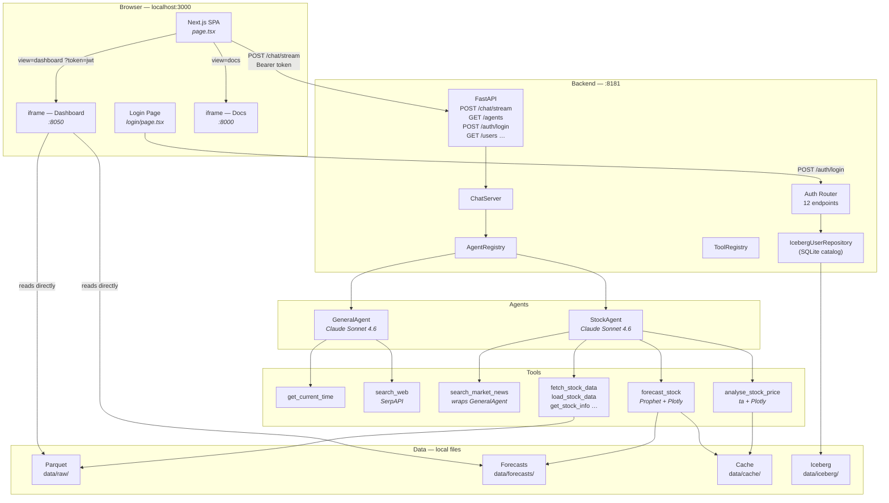
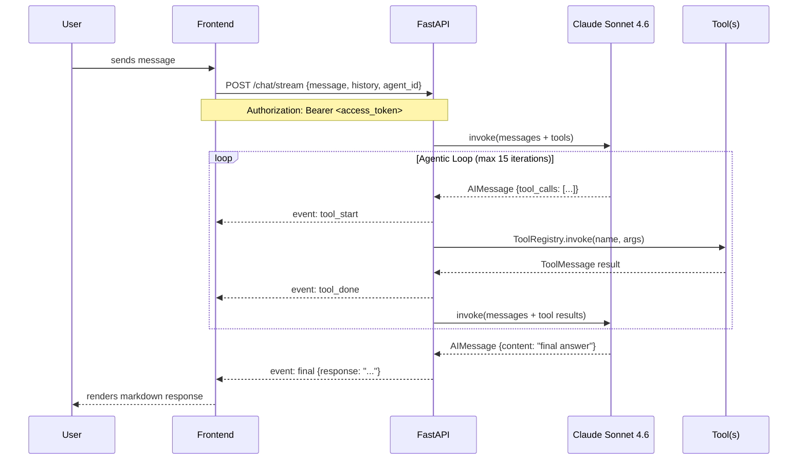
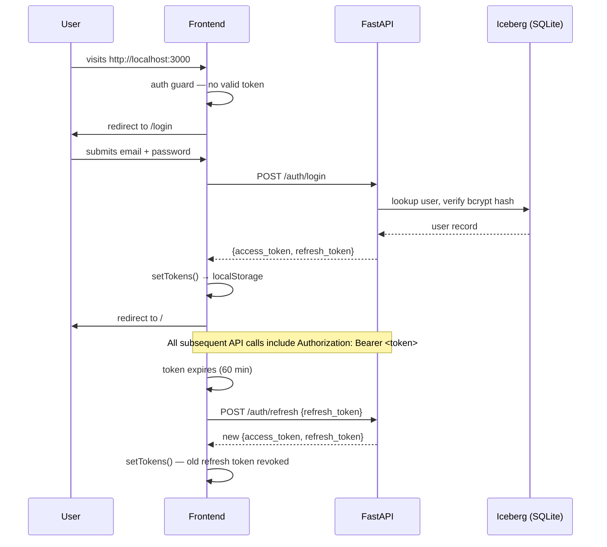
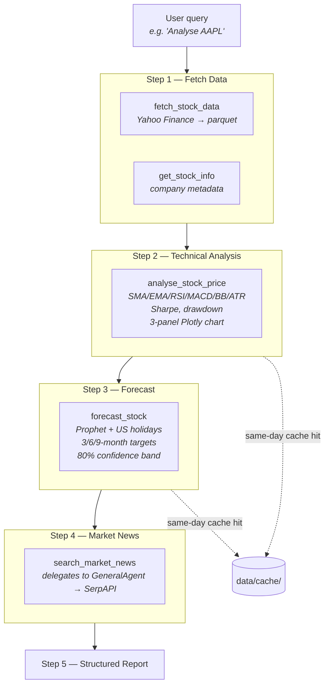

# AI Agent UI

A fullstack agentic chat application powered by LangChain, FastAPI, and Next.js. The backend runs an LLM in a tool-calling loop; the frontend is a single-page app that embeds the Docs and Dashboard in-context alongside the chat interface. JWT authentication and role-based access control protect all three surfaces.

---

## Services at a Glance

| Service | Stack | Port | Purpose |
|---------|-------|------|---------|
| **Frontend** | Next.js 16 + React 19 + Tailwind 4 | `3000` | Chat UI + SPA shell (login, chat, docs, dashboard, admin) |
| **Backend** | FastAPI + LangChain + Claude Sonnet 4.6 | `8181` | Agentic loop + REST API + Auth endpoints |
| **Dashboard** | Plotly Dash + Dash Bootstrap (FLATLY) | `8050` | Stock analysis dashboard (Home / Analysis / Forecast / Compare) + Admin UI (Users + Audit Log) |
| **Docs** | MkDocs Material | `8000` | Project documentation |

---

## Quick Start

```bash
# 1. Create backend/.env with your keys and JWT secret
cat > backend/.env <<EOF
ANTHROPIC_API_KEY=sk-ant-...
JWT_SECRET_KEY=$(python -c "import secrets; print(secrets.token_hex(32))")
ADMIN_EMAIL=admin@example.com
ADMIN_PASSWORD=Admin1234
SERPAPI_API_KEY=abc123...   # optional — needed for web search
EOF

# 2. Create the frontend env file
cp frontend/.env.local.example frontend/.env.local

# 3. Start everything
#    On first run: Iceberg tables are created and superuser is seeded automatically
./run.sh start

# 4. Log in and open the chat
open http://localhost:3000/login
```

Stop all services: `./run.sh stop` · Status: `./run.sh status`

---

## System Architecture



---

## Agentic Loop

Every message goes through an LLM-driven tool-calling loop before a response is returned, streamed live to the browser via NDJSON.



---

## Auth Flow



---

## Stock Analysis Pipeline



---

## Frontend SPA

The entire UI is one mounted React component. The `view` state switches between chat, docs, dashboard, and admin without unmounting — chat history is always preserved.

```
┌──────────────────────────────────────────────────────────────┐
│  ✦ AI Agent  [General | Stock Analysis]  [Sign out]  [🗑]    │ ← header
│           (breadcrumb label when view ≠ chat)                │
├──────────────────────────────────────────────────────────────┤
│                                                              │
│  view = "chat"            │  view = "docs" / "dashboard"    │
│  ─────────────────────    │    / "admin"                    │
│  scrollable messages      │  <iframe src={iframeUrl ??      │
│  + StatusBadge (stream)   │    baseServiceUrl}?token=jwt>   │
│  + input textarea         │                                  │
│                                                              │
└──────────────────────────────────────────────────────────────┘
                                              [⊞] ← FAB (bottom-right)
                                         Chat / Docs / Dashboard / Admin
```

---

## Project Structure

```
ai-agent-ui/
├── run.sh                    # Unified launcher (start/stop/status/restart)
├── README.md
├── CLAUDE.md                 # Claude Code project context
├── PROGRESS.md               # Session log
│
├── auth/                     # Auth package (project root — importable by backend + scripts)
│   ├── __init__.py
│   ├── create_tables.py      # One-time Iceberg table init (idempotent)
│   ├── migrate_users_table.py # Iceberg schema evolution (add columns)
│   ├── service.py            # AuthService — bcrypt + JWT lifecycle + deny-list
│   ├── dependencies.py       # FastAPI dependency functions
│   ├── oauth_service.py      # Google + Facebook PKCE OAuth2
│   ├── models/               # Pydantic request/response models (package)
│   ├── repo/                 # IcebergUserRepository, user writes, OAuth repo (package)
│   └── endpoints/            # create_auth_router() — 12+ endpoints (package)
│
├── hooks/
│   ├── pre-commit            # Bash entry — quality gate on every commit
│   ├── pre_commit_checks.py  # Python impl: static analysis, meta-files, docs, changelog
│   └── pre-push              # Bash entry — blocks pushes with print()/failing mkdocs build
│
├── scripts/
│   └── seed_admin.py         # Bootstrap first superuser from env vars
│
├── frontend/                 # Next.js 16
│   ├── app/
│   │   ├── page.tsx          # SPA shell (chat + docs + dashboard + admin views)
│   │   ├── login/
│   │   │   └── page.tsx      # Login page (email/password + Google SSO)
│   │   ├── auth/oauth/callback/
│   │   │   └── page.tsx      # OAuth2 PKCE callback
│   │   ├── layout.tsx
│   │   └── globals.css
│   ├── components/           # Extracted UI components
│   │   ├── ChatHeader.tsx    # Header bar + profile dropdown
│   │   ├── ChatInput.tsx     # Textarea + send button
│   │   ├── MessageBubble.tsx # Individual message (markdown)
│   │   ├── NavigationMenu.tsx # FAB + popup nav (RBAC-filtered)
│   │   ├── IFrameView.tsx    # Dashboard/Docs iframe wrapper
│   │   ├── EditProfileModal.tsx
│   │   └── ChangePasswordModal.tsx
│   ├── hooks/                # Custom React hooks
│   │   ├── useAuthGuard.ts   # Redirect to /login if no valid token
│   │   ├── useChatHistory.ts # Per-agent history + debounced localStorage
│   │   ├── useSendMessage.ts # Streaming fetch + AbortController
│   │   ├── useEditProfile.ts # PATCH /auth/me + avatar upload
│   │   └── useChangePassword.ts
│   ├── lib/
│   │   ├── auth.ts           # JWT token helpers
│   │   ├── apiFetch.ts       # Authenticated fetch wrapper (auto-refresh)
│   │   ├── constants.ts      # AGENTS list, NAV_ITEMS, View type
│   │   └── oauth.ts          # PKCE helpers + sessionStorage helpers
│   ├── .env.local            # Gitignored — copy from .env.local.example
│   └── .env.local.example    # Committed reference
│
├── backend/                  # FastAPI
│   ├── main.py               # ChatServer, routes, auth router mount
│   ├── config.py             # Pydantic Settings (.env support)
│   ├── logging_config.py     # Rotating file + console logging
│   ├── llm_fallback.py       # FallbackLLM — Groq primary, Anthropic fallback
│   ├── agents/
│   │   ├── base.py           # BaseAgent ABC
│   │   ├── config.py         # AgentConfig dataclass
│   │   ├── loop.py           # Agentic loop logic
│   │   ├── stream.py         # NDJSON streaming support
│   │   ├── registry.py       # AgentRegistry
│   │   ├── general_agent.py  # GeneralAgent (Claude Sonnet 4.6)
│   │   └── stock_agent.py    # StockAgent (Claude Sonnet 4.6)
│   └── tools/
│       ├── registry.py       # ToolRegistry
│       ├── time_tool.py      # get_current_time
│       ├── search_tool.py    # search_web (SerpAPI)
│       ├── agent_tool.py     # search_market_news (wraps GeneralAgent)
│       ├── stock_data_tool.py      # 6 Yahoo Finance tools
│       ├── price_analysis_tool.py  # analyse_stock_price
│       └── forecasting_tool.py     # forecast_stock (Prophet)
│
├── stocks/                   # Iceberg persistence for all stock data
│   ├── create_tables.py      # Idempotent init of 8 tables (called by run.sh)
│   ├── repository.py         # StockRepository — CRUD for all 8 tables
│   └── backfill.py           # One-time flat-file → Iceberg migration
│
├── dashboard/                # Plotly Dash (FLATLY light theme)
│   ├── app.py                # Entry point, routing, auth store, dotenv loader
│   ├── app_layout.py         # Root layout + display_page routing callback
│   ├── layouts/              # Stateless page-layout factories (package)
│   │   ├── home.py           # Home cards + market filter + pagination
│   │   ├── analysis.py       # Technical analysis chart layout
│   │   ├── insights_tabs.py  # Screener/Targets/Dividends/Risk/Sectors/Correlation
│   │   ├── admin.py          # User management + audit log layout
│   │   └── navbar.py         # Global navbar
│   ├── callbacks/            # Interactive callbacks (package)
│   │   ├── data_loaders.py   # Parquet + Iceberg reads, indicator caching
│   │   ├── chart_builders.py # Plotly figure construction
│   │   ├── home_cbs.py       # Home page callbacks
│   │   ├── analysis_cbs.py   # Analysis + Compare callbacks
│   │   ├── insights_cbs.py   # All Insights tab callbacks
│   │   ├── admin_cbs.py      # User table callbacks
│   │   ├── admin_cbs2.py     # Add/Edit/Deactivate user modals
│   │   ├── iceberg.py        # Iceberg repo singleton + cached helpers
│   │   └── utils.py          # Shared utilities (currency, market label)
│   └── assets/custom.css     # Light theme styles
│
├── data/
│   ├── raw/                  # OHLCV parquet (gitignored)
│   ├── forecasts/            # Prophet output parquet (gitignored)
│   ├── cache/                # Same-day text cache (gitignored)
│   ├── iceberg/              # Iceberg catalog + warehouse (gitignored)
│   └── metadata/             # Stock registry + company info (tracked)
│
├── charts/                   # Generated Plotly HTML (gitignored)
├── docs/                     # MkDocs source
└── mkdocs.yml
```

---

## Tech Stack

### Frontend
| Package | Version | Role |
|---------|---------|------|
| Next.js | 16 | Framework |
| React | 19 | UI |
| Tailwind CSS | 4 | Styling |
| react-markdown + remark-gfm | 10 / 4 | Markdown rendering |
| TypeScript | 5 | Type safety |

### Backend
| Package | Role |
|---------|------|
| FastAPI + uvicorn | HTTP server |
| LangChain | Agentic loop + tool binding |
| langchain-anthropic | Anthropic Claude LLM provider |
| Pydantic v2 + pydantic-settings | Request/response models + settings |
| yfinance | Yahoo Finance OHLCV data |
| Prophet | Time-series forecasting |
| ta | Technical analysis indicators |
| Plotly | Interactive HTML charts |
| pyarrow | Parquet read/write |
| pandas / numpy | Data manipulation |

### Dashboard
| Package | Role |
|---------|------|
| Dash 4 | Web framework |
| dash-bootstrap-components (FLATLY) | Light Bootstrap theme |
| Plotly | Charts |

### Auth
| Package | Role |
|---------|------|
| python-jose | JWT (HS256) signing and verification |
| passlib + bcrypt 4 | Password hashing (bcrypt cost 12) |
| pyiceberg[sql-sqlite] | Apache Iceberg storage (SQLite catalog) |
| python-multipart | OAuth2 form endpoint support |
| email-validator | `EmailStr` field validation |

---

## Environment Variables

All backend variables live in `backend/.env` (gitignored).

| Variable | Required | Default | Description |
|----------|----------|---------|-------------|
| `ANTHROPIC_API_KEY` | Yes | — | Anthropic API key (Claude Sonnet 4.6) |
| `JWT_SECRET_KEY` | Yes | — | JWT signing secret — min 32 random chars |
| `ADMIN_EMAIL` | First run | — | Superuser email for seed script |
| `ADMIN_PASSWORD` | First run | — | Superuser password (min 8 chars, 1 digit) |
| `SERPAPI_API_KEY` | No | — | Web search — `search_web` returns error without it |
| `ACCESS_TOKEN_EXPIRE_MINUTES` | No | `60` | JWT access token TTL |
| `REFRESH_TOKEN_EXPIRE_DAYS` | No | `7` | JWT refresh token TTL |
| `LOG_LEVEL` | No | `DEBUG` | Minimum log severity |
| `LOG_TO_FILE` | No | `true` | Write logs to `backend/logs/agent.log` |
| `NEXT_PUBLIC_BACKEND_URL` | No | `http://127.0.0.1:8181` | `frontend/.env.local` |
| `NEXT_PUBLIC_DASHBOARD_URL` | No | `http://127.0.0.1:8050` | `frontend/.env.local` |
| `NEXT_PUBLIC_DOCS_URL` | No | `http://127.0.0.1:8000` | `frontend/.env.local` |

---

## Extending the App

### Add a new tool

1. Create `backend/tools/my_tool.py` with a `@tool`-decorated function.
2. Register it in `ChatServer._register_tools()` in `main.py`.
3. Add the tool name to the relevant agent's `tool_names` list.

### Add a new agent

1. Subclass `BaseAgent` in `backend/agents/my_agent.py` — only implement `_build_llm()`.
2. Register it in `ChatServer._register_agents()`.
3. Add the agent ID to the `AGENTS` array in `frontend/lib/constants.ts`.

### Install the pre-commit hook (one-time)

```bash
cp hooks/pre-commit .git/hooks/pre-commit && chmod +x .git/hooks/pre-commit
```

Runs on every `git commit` against **staged files only**. Four checks:

| # | Check | API required? |
|---|-------|--------------|
| 1 | Bare `print()`, missing Google docstrings, naming, OOP, XSS/SQL injection — **auto-fixed** via Claude | Yes (auto-fix) |
| 2 | `CLAUDE.md`, `PROGRESS.md`, `README.md` freshness — **auto-updated** | Yes |
| 3 | Docs pages freshness — **auto-updated** | Yes |
| 4 | `docs/dev/changelog.md` descending date order — **auto-reordered** | No |

Set `ANTHROPIC_API_KEY` in `backend/.env` to enable checks 1–3. Skip entirely with `SKIP_PRE_COMMIT=1`.

---

## Deployment Notes

### First run
`./run.sh start` automatically runs `auth/create_tables.py` and `scripts/seed_admin.py` when `data/iceberg/catalog.db` does not yet exist. Set `ADMIN_EMAIL` and `ADMIN_PASSWORD` in `backend/.env` before the first start.

### Existing deployments (after SSO was added Feb 26)
Run the schema migration once to add the three OAuth columns:
```bash
source backend/demoenv/bin/activate
python auth/migrate_users_table.py
```

### Auth implementation quirks (important for debugging)
- **JWT env propagation** — `auth/dependencies.py` reads `JWT_SECRET_KEY` from `os.environ` directly. `backend/main.py` copies all Pydantic settings into `os.environ` at startup to bridge the gap. If auth endpoints raise `ValueError: JWT_SECRET_KEY must be at least 32 characters`, check that `JWT_SECRET_KEY` is in `backend/.env`.
- **Dashboard JWT** — Dash is a separate process; it never inherits `backend/.env`. `dashboard/app.py` calls `_load_dotenv()` at import time to load the file explicitly.

### SSO / OAuth2 (Google + Facebook PKCE)

| Variable | Notes |
|----------|-------|
| `GOOGLE_CLIENT_ID` | Required for Google SSO |
| `GOOGLE_CLIENT_SECRET` | Required for Google SSO |
| `FACEBOOK_APP_ID` | Facebook SSO (placeholder — button hidden until set) |
| `FACEBOOK_APP_SECRET` | Facebook SSO (placeholder) |
| `OAUTH_REDIRECT_URI` | Default: `http://localhost:3000/auth/oauth/callback` |

Register `http://localhost:3000/auth/oauth/callback` as an authorised redirect URI in Google Cloud Console.

---

## Deployment Notes

### First run
`./run.sh start` automatically runs `auth/create_tables.py` and `scripts/seed_admin.py` when `data/iceberg/catalog.db` does not yet exist. Set `ADMIN_EMAIL` and `ADMIN_PASSWORD` in `backend/.env` before the first start.

### Existing deployments (after SSO was added Feb 26)
Run the schema migration once to add the three OAuth columns:
```bash
source backend/demoenv/bin/activate
python auth/migrate_users_table.py
```

### Auth implementation quirks (important for debugging)
- **JWT env propagation** — `auth/dependencies.py` reads `JWT_SECRET_KEY` from `os.environ` directly. `backend/main.py` copies all Pydantic settings into `os.environ` at startup to bridge the gap. If auth endpoints raise `ValueError: JWT_SECRET_KEY must be at least 32 characters`, check that `JWT_SECRET_KEY` is in `backend/.env`.
- **Dashboard JWT** — Dash is a separate process; it never inherits `backend/.env`. `dashboard/app.py` calls `_load_dotenv()` at import time to load the file explicitly.

### SSO / OAuth2 (Google + Facebook PKCE)

| Variable | Notes |
|----------|-------|
| `GOOGLE_CLIENT_ID` | Required for Google SSO |
| `GOOGLE_CLIENT_SECRET` | Required for Google SSO |
| `FACEBOOK_APP_ID` | Facebook SSO (placeholder — button hidden until set) |
| `FACEBOOK_APP_SECRET` | Facebook SSO (placeholder) |
| `OAUTH_REDIRECT_URI` | Default: `http://localhost:3000/auth/oauth/callback` |

Register `http://localhost:3000/auth/oauth/callback` as an authorised redirect URI in Google Cloud Console.

---

## Deployment Notes

### First run
`./run.sh start` automatically runs `auth/create_tables.py` and `scripts/seed_admin.py` when `data/iceberg/catalog.db` does not yet exist. Set `ADMIN_EMAIL` and `ADMIN_PASSWORD` in `backend/.env` before the first start.

### Existing deployments (after SSO was added Feb 26)
Run the schema migration once to add the three OAuth columns:
```bash
source backend/demoenv/bin/activate
python auth/migrate_users_table.py
```

### Auth implementation quirks (important for debugging)
- **JWT env propagation** — `auth/dependencies.py` reads `JWT_SECRET_KEY` from `os.environ` directly. `backend/main.py` copies all Pydantic settings into `os.environ` at startup to bridge the gap. If auth endpoints raise `ValueError: JWT_SECRET_KEY must be at least 32 characters`, check that `JWT_SECRET_KEY` is in `backend/.env`.
- **Dashboard JWT** — Dash is a separate process; it never inherits `backend/.env`. `dashboard/app.py` calls `_load_dotenv()` at import time to load the file explicitly.

### SSO / OAuth2 (Google + Facebook PKCE)

| Variable | Notes |
|----------|-------|
| `GOOGLE_CLIENT_ID` | Required for Google SSO |
| `GOOGLE_CLIENT_SECRET` | Required for Google SSO |
| `FACEBOOK_APP_ID` | Facebook SSO (placeholder — button hidden until set) |
| `FACEBOOK_APP_SECRET` | Facebook SSO (placeholder) |
| `OAUTH_REDIRECT_URI` | Default: `http://localhost:3000/auth/oauth/callback` |

Register `http://localhost:3000/auth/oauth/callback` as an authorised redirect URI in Google Cloud Console.

---

## Known Limitations

| Issue | Notes |
|-------|-------|
| **`SERPAPI_API_KEY` required for web search** | Free tier (100/month) at serpapi.com |
| **Refresh token deny-list is in-memory** | Cleared on backend restart — revoked tokens become valid again until natural expiry (7 days) |
| **Facebook SSO** | Code complete; credentials are placeholders — button hidden until real credentials added |
