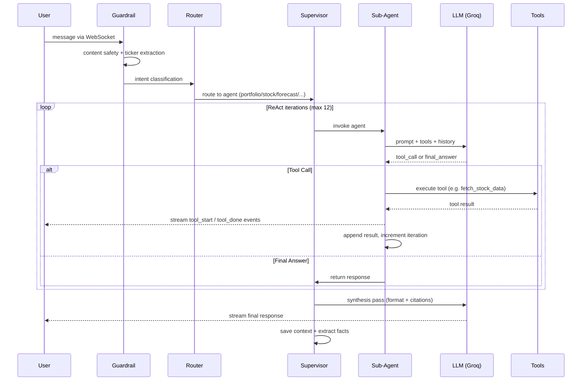
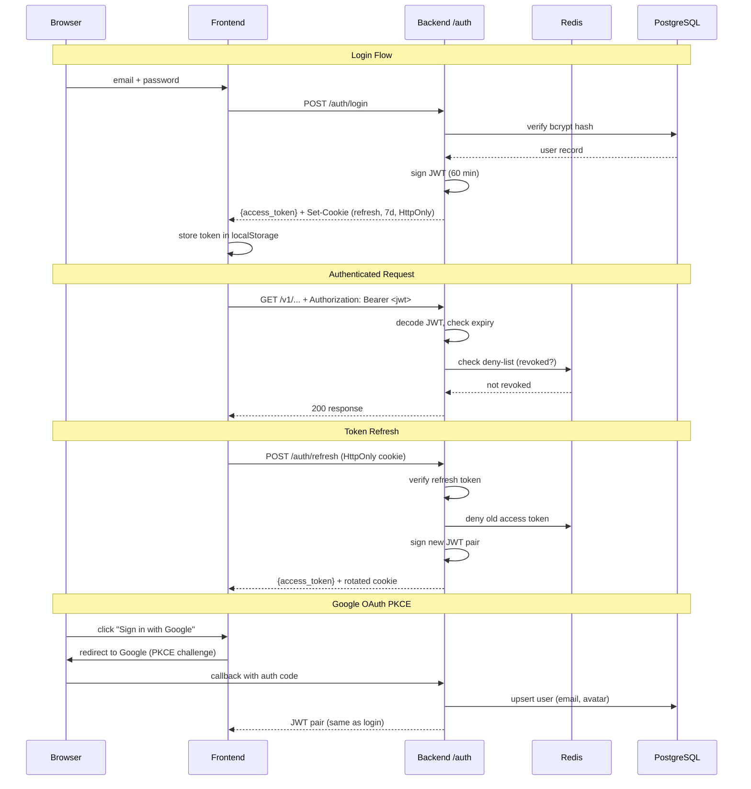
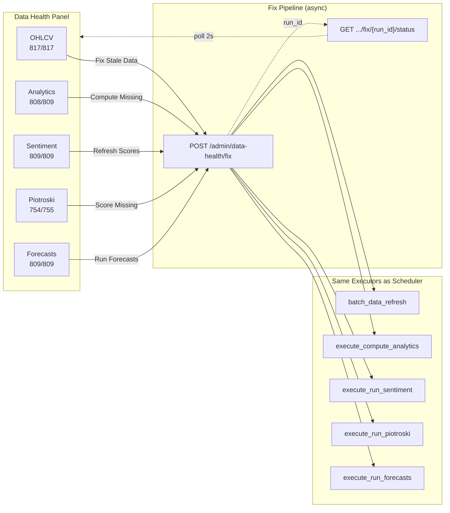

# AI Agent UI

A fullstack agentic chat application with stock analysis, Prophet forecasting, and portfolio management. LangGraph supervisor with 6 sub-agents, memory-augmented multi-turn conversations with PG-persisted context. Hybrid PostgreSQL + Apache Iceberg data layer with DuckDB read acceleration. Smart Funnel recommendation engine. Automated pipeline orchestration for 817 tickers (755 stocks + 54 ETFs + 8 indices/commodities) across India and US markets.

---

## Features

- **6 AI sub-agents** — Portfolio, Stock Analyst, Forecaster, Research, Sentiment, Recommendation (LangGraph supervisor routing)
- **Memory-augmented chat** — pgvector semantic memory (768-dim), per-user facts + PG-persisted conversation context (cross-session resume)
- **Round-robin LLM pools** — 5 Groq models (~2.0M TPD), Ollama local fallback, Anthropic paid tier
- **Prophet forecasting** — volatility-regime adaptive (stable/moderate/volatile), 11 enriched regressors, log-transform + logistic growth, post-Prophet RSI/MACD/volume bias adjustment, composite confidence score with High/Medium/Low badges on Analysis + Portfolio UIs
- **Portfolio dashboard** — TradingView charts, sector allocation, P&L trend, news sentiment, recommendations widget
- **Smart Funnel recommendations** — 3-stage pipeline (DuckDB pre-filter → gap analysis → LLM reasoning), market-scoped, **1 run per (user, scope, IST calendar month)**, shared consolidator across widget/chat/scheduler, `scope="all"` auto-expands to India + US, admin force-refresh + promote workflow for testing
- **Recommendation acted-on tracking** — portfolio Add/Edit/Delete auto-flips matching recs to `acted_on`, green "+ Buy" / "Edit" pills on every rec row, in-place Add/Edit modals via `PortfolioActionsProvider` (no route hops), scope-aware adoption-rate KPIs
- **54 NSE ETFs** — broad market, sectoral, factor, gold/silver, international, debt ETFs with OHLCV, analytics, sentiment, and Prophet forecasts
- **Piotroski F-Score** — fundamental scoring (755 stocks), market filter (India/US)
- **Sentiment scoring** — FinBERT batch sentiment (ProsusAI/finbert, CPU-only, zero API cost) + LLM fallback, hot/learning/cold tiers, market fallback, accurate `source` provenance (`finbert | llm | market_fallback | none`), per-source 10s HTTP timeout, learning-set cap (top-50 by market cap), superuser Data Health details modal
- **Pipeline orchestration** — 4-step pipelines (Data Refresh → Analytics → Sentiment → Piotroski), force run, DAG viz
- **Scheduler** — cron jobs with freshness gates, CV reuse (30-day TTL), catchup on restart
- **Data Health dashboard** — 5 health cards with async fix buttons, live progress bars, parallelized DuckDB queries (~1.4s)
- **ScreenQL universal screener** — text-based stock query language (36 fields, 6 Iceberg tables), recursive descent parser, DuckDB SQL, 6 presets, autocomplete, dynamic columns, currency symbols
- **Insights screener** — 809 tickers with sentiment, RSI, MACD, Sharpe, tag/index filters (Nifty 50/100/500, cap sizes), CSV export on all data tabs
- **CSV download** — centralized utility on 10 tabs (Insights + Admin), respects current filters
- **Iceberg maintenance** — backup (rsync + catalog.db), compaction, 11yr retention, post-pipeline snapshot expiry
- **Backup Health panel** — readonly admin dashboard with health badge, folder browser, Redis-cached
- **Bulk OHLCV download** — yf.download() batches of 100 (99.8% success, 58s for 804 tickers)
- **Live market ticker** — Nifty 50 + Sensex in header, dual-source (NSE India + Yahoo Finance), 30s refresh
- **RBAC with Pro tier** — three roles (`general` / `pro` / `superuser`). Pro users auto-activate on paid subscription (superuser sticky), see Insights + a 3-tab scoped Admin view (My Account, My Audit Log, My LLM Usage); superuser sees all 7 tabs. Self-scoped admin endpoints via `?scope=self|all` gate.
- **Bring Your Own Model (BYOM)** — chat agent shifts from *platform-pays-all* to *platform-pays-first-10-then-BYO*. Every non-superuser gets **10 lifetime free chat turns**; past that they must configure their own Groq and/or Anthropic key or chat is blocked (`HTTP 429`). Fernet-encrypted keys, Redis-backed IST monthly counter, user-settable monthly cap. `FallbackLLM._try_model` routes each Groq/Anthropic hop through the user's key via a per-request `ContextVar`; cascade falls back to shared Ollama when available. Non-chat flows (recommendations, sentiment, forecast) and superusers continue on platform keys. My LLM Usage tab surfaces free/BYO split per model with `key_source` stamped on `stocks.llm_usage`. Full workflow: [docs/backend/byom.md](docs/backend/byom.md).
- **Insights three-tier ticker scoping** — 9 Insights tabs mapped to `discovery` / `watchlist` / `portfolio` scopes via a single `_scoped_tickers(user, scope)` helper. Pro + superuser get the full stock+ETF universe on Screener, ScreenQL, Sectors, and Piotroski; Risk/Targets/Dividends stay on watchlist ∪ holdings for everyone; Correlation + Quarterly are portfolio-only (current holdings).
- **Dual payment gateways** — Razorpay (INR) + Stripe (USD)
- **Docker Compose** — 5 services, single command start
- **19 CLI pipeline commands** — seed, download, analytics, sentiment, forecast, screen, refresh

---

## Services

| Service | Stack | Port |
|---------|-------|------|
| **Frontend** | Next.js 16 + React 19 + Tailwind 4 + lightweight-charts v5 | 3000 |
| **Backend** | FastAPI + LangChain 1.2 + SQLAlchemy 2.0 async | 8181 |
| **PostgreSQL** | pgvector:pg16 (18 OLTP tables + pgvector) | 5432 |
| **Redis** | Redis 7 Alpine | 6379 |
| **Docs** | MkDocs Material 9 | 8000 |

---

## Quick Start

```bash
git clone git@github.com:asequitytrading-design/ai-agent-ui.git
cd ai-agent-ui
cp .env.example .env                    # fill in API keys
docker compose up -d                    # start all 5 services
docker compose exec backend python scripts/seed_demo_data.py
```

Open [http://localhost:3000](http://localhost:3000) — login: `admin@demo.com` / `Admin123!`

### Alternative: Native Setup

```bash
./setup.sh                              # interactive installer
./run.sh start                          # start all services
```

| Flag | Purpose |
|------|---------|
| `--non-interactive` | Read secrets from env vars (CI/Docker) |
| `--force` | Reset state and re-run everything |
| `--repair` | Fix symlinks, env files, git hooks only |

### Platform Guides

- [macOS](http://localhost:8000/setup/macos/) — Homebrew, pyenv, Node.js
- [Linux](http://localhost:8000/setup/linux/) — apt, pyenv, nvm
- [Windows](http://localhost:8000/setup/windows/) — WSL2 + Ubuntu

---

## Architecture


---

## ReAct Agent Loop

Each sub-agent uses a ReAct (Reason + Act) loop with tool calling. The supervisor routes to the right agent, which iterates until it has enough data to synthesize a response.



---

## Auth Flow

JWT access tokens (60 min) + HttpOnly refresh cookies (7 days). Token deny-list in Redis. OAuth PKCE for Google SSO.



---

## Data Pipeline & Ticker Classification

### Ticker Types

The registry classifies every ticker for correct pipeline routing:

| Type | Count | Examples | Pipelines |
|------|-------|---------|-----------|
| `stock` | 755 | RELIANCE.NS, AAPL | All (OHLCV, Analytics, Sentiment, Piotroski, Forecast) |
| `etf` | 54 | NIFTYBEES.NS, GOLDBEES.NS | OHLCV, Analytics, Sentiment, Forecast |
| `index` | 4 | ^NSEI, ^GSPC, ^VIX | OHLCV only (used as forecast regressors) |
| `commodity` | 4 | CL=F, ^TNX, DX-Y.NYB | OHLCV only (used as forecast regressors) |

### Data Health Fix Panel

The Maintenance page provides one-click fix buttons for each pipeline:



---

## Database

### PostgreSQL (18 tables — OLTP, row-level CRUD)

| Table | Purpose |
|-------|---------|
| `auth.users` | User accounts (bcrypt, RBAC) |
| `auth.user_tickers` | Portfolio/watchlist links |
| `auth.payment_transactions` | Razorpay/Stripe ledger |
| `public.user_memories` | pgvector semantic memory (768-dim) |
| `public.conversation_contexts` | Chat context persistence (cross-session resume) |
| `stocks.registry` | Ticker registry (yf_ticker, market, ticker_type) |
| `stocks.scheduled_jobs` | Cron job definitions (force flag) |
| `stocks.scheduler_runs` | Execution records (status, progress) |
| `stocks.recommendation_runs` | Smart Funnel run metadata + portfolio snapshot |
| `stocks.recommendations` | Individual recs with data_signals JSONB |
| `stocks.recommendation_outcomes` | 30/60/90-day outcome checkpoints |
| `stocks.market_indices` | Nifty+Sensex ticker cache (PG+Redis) |
| `stock_master` | Pipeline universe (symbol, ISIN, yf_ticker) |
| `stock_tags` | Temporal tags (nifty50, largecap, etf, etc.) |
| `ingestion_cursor` | Keyset pagination cursor |
| `ingestion_skipped` | Failed ticker log + retry |
| `sentiment_dormant` | Per-ticker headline-fetch dormancy (capped expo cooldown) |
| `pipelines` | Pipeline chain definitions |
| `pipeline_steps` | Ordered steps within pipelines |

### Iceberg (14 tables — OLAP, append-only analytics)

`ohlcv` (1.4M rows), `company_info`, `dividends`, `quarterly_results`,
`analysis_summary`, `forecast_runs`, `forecasts`, `piotroski_scores`,
`sentiment_scores`, `llm_pricing`, `llm_usage`, `portfolio_transactions`,
`audit_log`, `usage_history`

DuckDB serves as the primary read engine with in-memory metadata cache.

---

## Scheduler & Pipeline

### Job Types with Freshness Gates

| Job | Freshness | Skip if... | Cadence |
|-----|-----------|-----------|---------|
| Data Refresh | OHLCV latest date | `>= yesterday` | Daily |
| Compute Analytics | analysis_summary | computed today | Daily |
| Sentiment Scoring | scored_at | scored today | Daily |
| Forecasts | forecast run_date | `< 7 days old` | Weekly |
| Forecast CV | accuracy metrics | `< 30 days old` | Monthly (auto) |
| Piotroski F-Score | none | always recomputes | Monthly |
| Recommendations | recommendation_runs | `< 30 days` | Monthly |
| Rec Outcomes | outcome checkpoints | daily price check | Daily |

### Pipeline (India + USA Daily — 6 steps each, ~12 min)

Cron: `08:00 IST` (India) / `08:15 IST` (USA), Tue–Sat. Container runs
in `TZ=Asia/Kolkata` so cron strings match wall-clock IST.

```
Data Refresh → Compute Analytics → Sentiment → Piotroski → Rec Outcomes → Iceberg Maintenance
  (5 min)         (45s)            (3.5 min)     (2s)        (15s)         (~2 min, backup+compact)
```

Step 6 (`iceberg_maintenance`) is **fail-closed**: runs `run_backup()`
first, and if backup fails the compaction is skipped — preserving the
"backup before maintenance" safety rule. Compacts hot tables
(`ohlcv`, `sentiment_scores`, `company_info`, `analysis_summary`)
so file count stays bounded.

`scheduler_catchup_enabled=False` by default — startup catchup of
"missed" jobs is opt-in only (was silently pulling mid-day partial
data). Set `SCHEDULER_CATCHUP_ENABLED=true` to enable.

### Performance

| Optimization | Before | After |
|-------------|--------|-------|
| OHLCV batch load (817 tickers) | 167s | 0.87s |
| Freshness check | 329s | 0.44s |
| Forecast writes | 11.5 min | ~2s |
| Progress updates | 9s/call | 14ms/call |
| Weekly forecast (809 tickers) | ~33 min | ~8 min |
| Data health scan | 2.4s | 1.4s |

Workers: `cpu_count // 2`. Prophet CV: `parallel=None` (no nested processes).

---

## Frontend Pages

| Page | Route | Features |
|------|-------|----------|
| Portfolio | `/dashboard` | Hero stats, sector allocation, P&L, news, forecast |
| Analytics Home | `/analytics` | Stock cards, search, bulk actions |
| Stock Analysis | `/analytics/analysis` | Candlestick + indicators, forecast chart, compare |
| Insights | `/analytics/insights` | Screener (809 tickers), Risk, Sectors, Targets, Dividends, Correlation, Quarterly, Piotroski |
| Admin | `/admin` | Users, Audit, LLM Observability, Maintenance, Transactions, Scheduler |
| Docs | `/docs` | MkDocs Material embed |

All tabbed pages persist active tab in URL (`?tab=scheduler`).

---

## Stock Data Pipeline (CLI)

```bash
PYTHONPATH=.:backend python -m backend.pipeline.runner <command>
```

| Command | Description |
|---------|-------------|
| `download` | Fetch Nifty 500 CSV from NSE |
| `seed --csv ...` | Seed stock_master universe |
| `bulk-download` | Batch yfinance OHLCV (all tickers) |
| `fill-gaps` | Patch company_info gaps |
| `status` | Check cursor progress |
| `analytics --scope india` | Compute analysis summary |
| `sentiment --scope india` | LLM headline scoring |
| `forecast --scope india [--force]` | Prophet forecasts |
| `screen` | Piotroski F-Score |
| `indices` | Refresh market indices |
| `refresh --scope india --force` | Full pipeline chain |

---

## LLM Cascade

```
Tool Pool:    llama-3.3-70b → qwen3-32b              (round-robin)
Quality Pool: gpt-oss-120b → gpt-oss-20b             (round-robin)
Fast Pool:    scout-17b                               (single)
Local:        Ollama gpt-oss:20b                      (fallback)
Paid:         Anthropic claude-sonnet-4-6              (final fallback)
```

Progressive compression: system prompt → tool results → context window.

---

## Testing

```bash
python -m pytest tests/ -v              # 839 backend tests
cd frontend && npx vitest run           # 18 frontend tests
cd e2e && npm test                      # 257 E2E tests (needs live services)
```

---

## Development

```bash
./run.sh start                          # all services
./run.sh rebuild backend                # rebuild after code changes
./run.sh rebuild frontend               # rebuild frontend
./run.sh logs backend -f                # follow logs
./run.sh status                         # health check
./run.sh doctor                         # diagnostics
docker compose exec redis redis-cli FLUSHALL  # clear cache
```

---

## Documentation

Full docs at [http://localhost:8000](http://localhost:8000):

- [Scheduler & Pipelines](http://localhost:8000/stock_agent/scheduler/)
- [Maintenance & Data Health](http://localhost:8000/stock_agent/maintenance/)
- [Data Pipeline](http://localhost:8000/stock_agent/data-pipeline/)
- [API Reference](http://localhost:8000/backend/api/)
- [Auth & Users](http://localhost:8000/backend/auth/)

---

## License

Private repository. All rights reserved.
