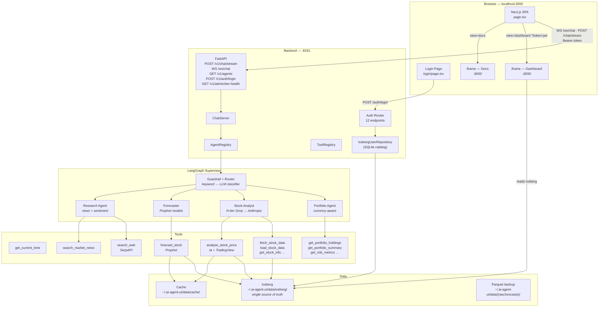
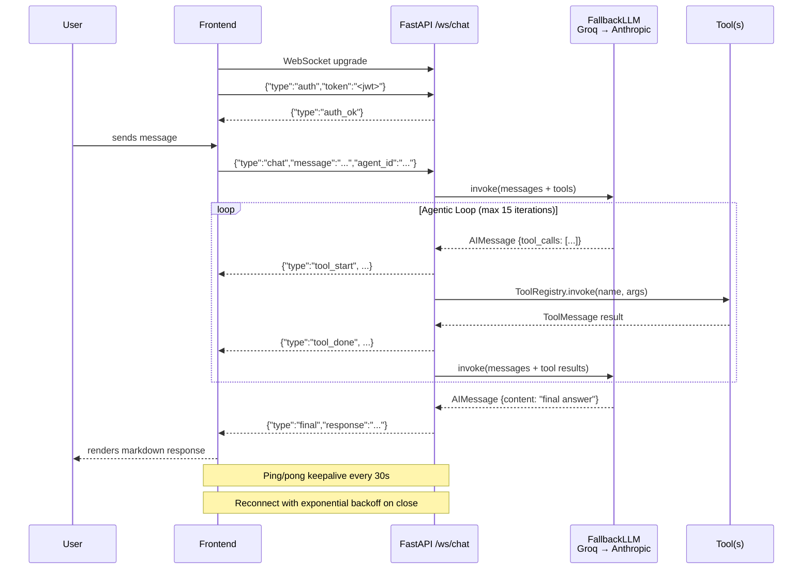
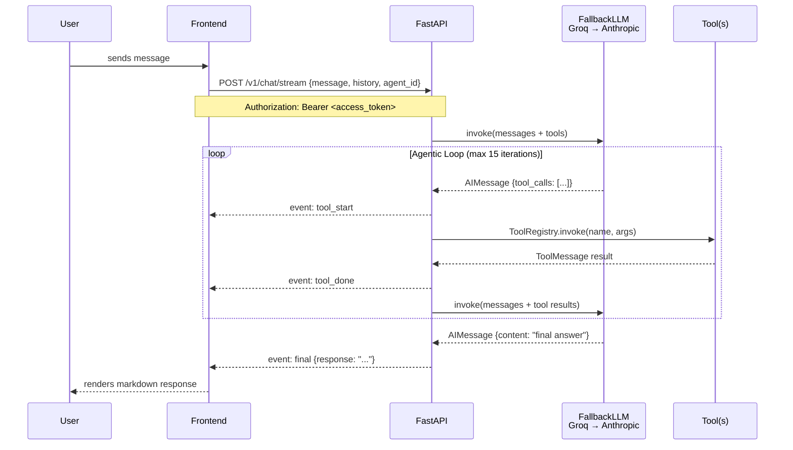
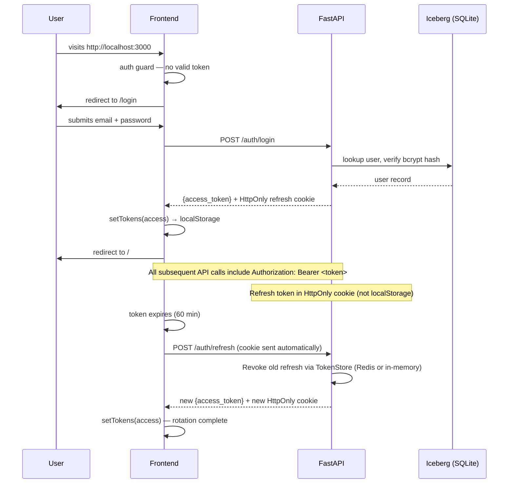
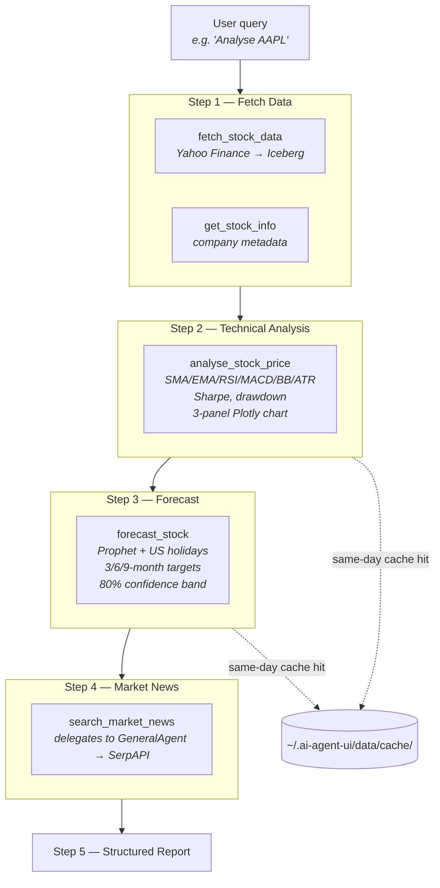

# AI Agent UI

A fullstack agentic chat application powered by LangChain, FastAPI, and Next.js. The backend runs an LLM in a tool-calling loop; the frontend is a single-page app with portfolio management, stock analysis (TradingView charts), and a chat side panel. JWT authentication and role-based access control protect all surfaces. Redis provides caching and session management.

---

## Services at a Glance

| Service | Stack | Port | Purpose |
|---------|-------|------|---------|
| **Frontend** | Next.js 16 + React 19 + Tailwind 4 + lightweight-charts v5 | `3000` | Portfolio dashboard, TradingView charts, collapsible sidebar, chat side panel |
| **Backend** | FastAPI + LangChain + N-tier Groq/Anthropic | `8181` | Agentic loop + REST/WebSocket API + Auth + Redis cache |
| **Redis** | Redis 7 | `6379` | Token deny-list, user preferences, API cache (write-through) |
| **Docs** | MkDocs Material | `8000` | Project documentation |

---

## First-Time Setup (Recommended)

```bash
git clone git@github.com:asequitytrading-design/ai-agent-ui.git
cd ai-agent-ui
./setup.sh          # interactive — prompts for API keys
./run.sh start      # start all services
```

`setup.sh` handles everything: Python 3.12 virtualenv, pip install, npm ci, directory creation, config files, `.pyiceberg.yaml`, Iceberg database init, admin seeding, and git hooks. Safe to re-run — completed steps are skipped automatically.

| Flag | Purpose |
|------|---------|
| `--non-interactive` | Read secrets from env vars (CI/Docker) |
| `--force` | Reset state and re-run everything from scratch |
| `--repair` | Fix only symlinks, env files, and git hooks |

For CI/Docker: `ANTHROPIC_API_KEY=sk-ant-... ./setup.sh --non-interactive`

### Platform-Specific Setup Guides

Detailed step-by-step guides with prerequisites for each OS:

| Platform | Guide | Key prerequisites |
|----------|-------|-------------------|
| **macOS** | [macOS Guide](http://127.0.0.1:8000/setup/macos/) | Xcode CLT, Homebrew, pyenv, Node.js, Redis |
| **Linux** (Ubuntu/Debian) | [Linux Guide](http://127.0.0.1:8000/setup/linux/) | apt packages, pyenv, Node.js (nvm), Redis |
| **Windows 11** | [Windows Guide](http://127.0.0.1:8000/setup/windows/) | WSL2 + Ubuntu, then follow Linux steps |

> **Windows users**: This project runs inside WSL2 (Windows Subsystem for Linux). The Windows guide walks you through the complete WSL2 setup, then the Linux installation inside it. Services are accessible from your Windows browser at `http://localhost:<port>`.

### AI Tooling Setup (for developers using Claude Code + Serena)

```bash
./scripts/dev-setup.sh    # verifies Claude Code, Serena, shared memories
```

This script checks prerequisites, validates shared Serena memories, creates local memory directories, and installs git hooks. Run after `setup.sh`.

**Env files are stored externally** at `~/.ai-agent-ui/` so branch checkouts and merges never overwrite your secrets. `backend/.env` and `frontend/.env.local` are symlinks (or copies on WSL2) to the master copies. Edit the files at `~/.ai-agent-ui/` directly.

## Quick Start (Manual)

```bash
# 1. Create backend/.env with your keys and JWT secret
cat > backend/.env <<EOF
ANTHROPIC_API_KEY=sk-ant-...
JWT_SECRET_KEY=$(python -c "import secrets; print(secrets.token_hex(32))")
ADMIN_EMAIL=admin@example.com
ADMIN_PASSWORD=Admin1234
SERPAPI_API_KEY=abc123...   # optional — needed for web search
EOF

# 2. Create the frontend env file
cp frontend/.env.local.example frontend/.env.local

# 3. Start everything
#    On first run: Iceberg tables are created and superuser is seeded automatically
./run.sh start

# 4. Log in and open the chat
open http://localhost:3000/login
```

Stop all services: `./run.sh stop` · Status: `./run.sh status`

---

## System Architecture



---

## Agentic Loop

Every message goes through an LLM-driven tool-calling loop before a response is returned. The frontend prefers a persistent **WebSocket** connection (`/ws/chat`) for lower latency and server-initiated events. If the WebSocket is unavailable, it falls back to **HTTP NDJSON** streaming (`POST /chat/stream`).

### WebSocket (primary)



### HTTP NDJSON (fallback)



---

## Auth Flow



---

## Stock Analysis Pipeline



---

## Frontend SPA

The frontend is a full SPA with a **collapsible sidebar** for navigation and a **native portfolio dashboard** as the post-login landing page. All pages use **TradingView lightweight-charts** (~45 KB) for stock and portfolio visualizations. A **chat side panel** (FAB-triggered, resizable drawer) provides access to the agentic chat from any page.

**Analysis page** — 5 tabs with underline navigation:
- **Portfolio Analysis**: daily value vs invested (TradingView dual-line + P&L histogram), cash-flow-adjusted metrics
- **Portfolio Forecast**: weighted Prophet forecast with confidence band, 4 explainable summary cards
- **Stock Analysis**: multi-pane candlestick chart (OHLC + Volume + RSI + MACD)
- **Stock Forecast**: Prophet forecast with confidence band per ticker
- **Compare Stocks**: normalized price comparison (multi-line)

```
┌────┬───────────────────────────────────────────────────────────┐
│ ◀  │  ✦ AI Agent  Dashboard › Analysis      [Sign out]  [💬]  │ ← header + breadcrumb
│    ├───────────────────────────────────────────────────────────┤
│ S  │                                                           │
│ i  │  /dashboard      → Portfolio dashboard (hero, widgets)    │
│ d  │  /analytics/*    → Analysis, Insights, Link Stock         │
│ e  │  /admin          → Users, Audit Log, LLM Observability    │
│ b  │  /docs           → MkDocs (:8000)                         │
│ a  │                                                           │
│ r  │                              ┌─────────────────┐          │
│    │                              │ Chat Side Panel │ ← FAB   │
│    │                              │ (resizable)     │          │
│ ▼  │                              └─────────────────┘          │
└────┴───────────────────────────────────────────────────────────┘
  ↑ collapsible sidebar
```

---

## Project Structure

```
ai-agent-ui/
├── setup.sh                  # First-time installer (interactive or --non-interactive)
├── run.sh                    # Unified launcher (start/stop/status/restart)
├── README.md
├── CLAUDE.md                 # Claude Code project context
├── PROGRESS.md               # Session log
│
├── auth/                     # Auth package (project root — importable by backend + scripts)
│   ├── __init__.py
│   ├── create_tables.py      # One-time Iceberg table init (incl. user_tickers, idempotent)
│   ├── migrate_users_table.py # Iceberg schema evolution (add columns)
│   ├── service.py            # AuthService — bcrypt + JWT lifecycle + deny-list
│   ├── dependencies.py       # FastAPI dependency functions
│   ├── oauth_service.py      # Google + Facebook PKCE OAuth2
│   ├── models/               # Pydantic request/response models (package)
│   ├── repo/                 # IcebergUserRepository, user writes, OAuth repo (package)
│   └── endpoints/            # Auth + ticker routes — 15+ endpoints (package)
│
├── hooks/
│   ├── pre-commit            # Bash entry — quality gate on every commit
│   ├── pre_commit_checks.py  # Python impl: static analysis, meta-files, docs, changelog
│   └── pre-push              # Bash entry — blocks pushes with print()/failing mkdocs build
│
├── scripts/
│   └── seed_admin.py         # Bootstrap first superuser from env vars
│
├── frontend/                 # Next.js 16
│   ├── app/
│   │   ├── page.tsx          # SPA shell (chat + docs + dashboard + admin views)
│   │   ├── login/
│   │   │   └── page.tsx      # Login page (email/password + Google SSO)
│   │   ├── auth/oauth/callback/
│   │   │   └── page.tsx      # OAuth2 PKCE callback
│   │   ├── layout.tsx
│   │   └── globals.css
│   ├── components/           # Extracted UI components
│   │   ├── ChatHeader.tsx    # Header bar + profile dropdown
│   │   ├── ChatInput.tsx     # Textarea + send button
│   │   ├── MessageBubble.tsx # Individual message (markdown)
│   │   ├── NavigationMenu.tsx # FAB + popup nav (RBAC-filtered)
│   │   ├── IFrameView.tsx    # Dashboard/Docs iframe wrapper
│   │   ├── EditProfileModal.tsx
│   │   ├── ChangePasswordModal.tsx
│   │   └── SessionManagementModal.tsx
│   ├── hooks/                # Custom React hooks
│   │   ├── useAuthGuard.ts   # Redirect to /login if no valid token
│   │   ├── useChatHistory.ts # Per-agent history + debounced localStorage
│   │   ├── useWebSocket.ts   # WS connection state machine + reconnect
│   │   ├── useSendMessage.ts # WS-preferred streaming + HTTP fallback
│   │   ├── useEditProfile.ts # PATCH /auth/me + avatar upload
│   │   ├── useChangePassword.ts
│   │   └── useSessionManagement.ts  # List + revoke active sessions
│   ├── lib/
│   │   ├── auth.ts           # JWT token helpers
│   │   ├── apiFetch.ts       # Authenticated fetch wrapper (auto-refresh)
│   │   ├── config.ts         # Service URLs (BACKEND_URL, WS_URL, etc.)
│   │   ├── constants.ts      # AGENTS list, NAV_ITEMS, View type
│   │   └── oauth.ts          # PKCE helpers + sessionStorage helpers
│   ├── .env.local            # Gitignored — copy from .env.local.example
│   └── .env.local.example    # Committed reference
│
├── backend/                  # FastAPI
│   ├── main.py               # ChatServer, routes, auth router mount
│   ├── config.py             # Pydantic Settings (.env support)
│   ├── logging_config.py     # Rotating file + console logging
│   ├── llm_fallback.py       # FallbackLLM — N-tier Groq cascade + Anthropic fallback
│   ├── token_budget.py       # Sliding-window TPM/RPM budget tracker
│   ├── message_compressor.py # 3-stage message compression
│   ├── observability.py      # Thread-safe metrics + tier health monitoring
│   ├── routes.py             # Route registration (/v1/ prefix) + admin endpoints
│   ├── ws.py                 # WebSocket /ws/chat endpoint (auth + streaming)
│   ├── agents/
│   │   ├── base.py           # BaseAgent ABC
│   │   ├── config.py         # AgentConfig dataclass
│   │   ├── loop.py           # Agentic loop logic
│   │   ├── stream.py         # NDJSON streaming support
│   │   ├── registry.py       # AgentRegistry
│   │   ├── general_agent.py  # GeneralAgent (Claude Sonnet 4.6)
│   │   └── stock_agent.py    # StockAgent (Claude Sonnet 4.6)
│   └── tools/
│       ├── registry.py       # ToolRegistry
│       ├── time_tool.py      # get_current_time
│       ├── search_tool.py    # search_web (SerpAPI)
│       ├── agent_tool.py     # search_market_news (wraps GeneralAgent)
│       ├── stock_data_tool.py      # 7 Yahoo Finance tools (incl. fetch_quarterly_results)
│       ├── price_analysis_tool.py  # analyse_stock_price
│       ├── forecasting_tool.py     # forecast_stock (Prophet)
│       └── _ticker_linker.py      # Auto-link tickers to users from chat
│
├── stocks/                   # Iceberg persistence — single source of truth
│   ├── create_tables.py      # Idempotent init of 9 tables (called by run.sh)
│   ├── repository.py         # StockRepository — CRUD + batch reads for all 9 tables
│   ├── backfill_metadata.py  # One-time JSON → Iceberg migration
│   └── backfill_adj_close.py # One-time adj_close backfill from parquet
│
├── dashboard/                # Plotly Dash (FLATLY light theme)
│   ├── app.py                # Entry point, routing, auth store, dotenv loader
│   ├── app_layout.py         # Root layout + display_page routing callback
│   ├── layouts/              # Stateless page-layout factories (package)
│   │   ├── home.py           # Home cards + market filter + pagination
│   │   ├── analysis.py       # Technical analysis chart layout
│   │   ├── insights_tabs.py  # Screener/Targets/Dividends/Risk/Sectors/Correlation/Quarterly
│   │   ├── admin.py          # User management + audit log layout
│   │   ├── observability.py  # LLM tier health + budget + cascade log
│   │   ├── marketplace.py   # Ticker marketplace — browse & add tickers
│   │   └── navbar.py         # Global navbar
│   ├── callbacks/            # Interactive callbacks (package)
│   │   ├── data_loaders.py   # Iceberg reads, indicator caching
│   │   ├── chart_builders.py # Plotly figure construction
│   │   ├── home_cbs.py       # Home page callbacks (batch pre-fetch)
│   │   ├── analysis_cbs.py   # Analysis + Compare callbacks
│   │   ├── insights_cbs.py   # All Insights tab callbacks
│   │   ├── admin_cbs.py      # User table callbacks
│   │   ├── admin_cbs2.py     # Add/Edit/Deactivate user modals
│   │   ├── observability_cbs.py # LLM metrics fetch + health card rendering
│   │   ├── auth_utils.py    # JWT validation + _api_call helper
│   │   ├── marketplace_cbs.py # Marketplace add/remove ticker callbacks
│   │   ├── iceberg.py        # Iceberg repo singleton + 8 TTL-cached helpers
│   │   └── utils.py          # Shared utilities (currency, market label)
│   └── assets/custom.css     # Light theme styles
│
├── e2e/                      # Playwright E2E tests
│   ├── playwright.config.ts  # 6 projects (setup, auth, frontend, dashboard, admin, errors)
│   ├── pages/                # Page Object Models (10 classes)
│   ├── tests/                # 14+ spec files, ~91 tests
│   ├── fixtures/             # Auth token fixtures for Dash
│   └── utils/                # Selectors, wait helpers, API helpers
│
├── docs/                     # MkDocs source
└── mkdocs.yml

# Runtime data lives OUTSIDE the repo at ~/.ai-agent-ui/:
# ~/.ai-agent-ui/
# ├── data/iceberg/           # Iceberg catalog + warehouse (single source of truth)
# ├── data/{cache,raw,forecasts,avatars}/  # runtime data
# ├── charts/{analysis,forecasts}/         # Plotly HTML
# ├── venv/                                # Python virtualenv (relocated from backend/demoenv)
# └── logs/                                # rotating service + agent logs
```

---

## Tech Stack

### Frontend
| Package | Version | Role |
|---------|---------|------|
| Next.js | 16 | Framework |
| React | 19 | UI |
| Tailwind CSS | 4 | Styling |
| react-plotly.js | 2 | Interactive charts (candlestick, heatmap, line) |
| react-markdown + remark-gfm | 10 / 4 | Markdown rendering |
| TypeScript | 5 | Type safety |

### Backend
| Package | Role |
|---------|------|
| FastAPI + uvicorn | HTTP server |
| LangChain | Agentic loop + tool binding |
| langchain-anthropic | Anthropic Claude LLM provider (fallback) |
| langchain-groq | Groq LLM provider (primary N-tier cascade) |
| Pydantic v2 + pydantic-settings | Request/response models + settings |
| yfinance | Yahoo Finance OHLCV data |
| Prophet | Time-series forecasting |
| ta | Technical analysis indicators |
| Plotly | Interactive HTML charts |
| pyarrow | Parquet read/write |
| pandas / numpy | Data manipulation |
| razorpay | Razorpay payment gateway SDK |

### Dashboard
| Package | Role |
|---------|------|
| Dash 4 | Web framework |
| dash-bootstrap-components (FLATLY) | Light Bootstrap theme |
| Plotly | Charts |

### Auth
| Package | Role |
|---------|------|
| python-jose | JWT (HS256) signing and verification |
| bcrypt 5 | Password hashing (bcrypt cost 12, direct — no passlib) |
| pyiceberg[sql-sqlite] | Apache Iceberg storage (SQLite catalog) |
| python-multipart | OAuth2 form endpoint support |
| email-validator | `EmailStr` field validation |

---

## Team Knowledge Sharing

Project knowledge is shared via git-committed Serena memories:

```
.serena/memories/
├── shared/              # Git-tracked, PR-reviewed
│   ├── architecture/    # System design (5 files)
│   ├── conventions/     # Coding standards (6 files)
│   ├── debugging/       # Gotchas & workarounds (2 files)
│   ├── onboarding/      # Setup guide (1 file)
│   └── api/             # Protocol docs (1 file)
├── session/             # Gitignored — daily progress
└── personal/            # Gitignored — individual notes
```

| Command | Purpose |
|---------|---------|
| `/promote-memory` | Promote session memory to shared (AI cleanup) |
| `/check-stale-memories` | Detect outdated shared memories |
| `./scripts/check-stale-memories.sh` | CI stale memory check |
| `./scripts/dev-setup.sh` | AI tooling onboarding |

CLAUDE.md contains only hard rules (~85 lines). All detailed architecture, conventions, and debugging knowledge lives in Serena shared memories, loaded on-demand to minimize token usage.

---

## Environment Variables

All backend variables live in `backend/.env` (gitignored).

| Variable | Required | Default | Description |
|----------|----------|---------|-------------|
| `ANTHROPIC_API_KEY` | Yes | — | Anthropic API key — Claude Sonnet 4.6 (final fallback) |
| `GROQ_API_KEY` | No | — | Groq API key — enables N-tier Groq cascade before Anthropic |
| `GROQ_MODEL_TIERS` | No | *(4 models)* | Comma-separated Groq model names tried in order |
| `JWT_SECRET_KEY` | Yes | — | JWT signing secret — min 32 random chars |
| `ADMIN_EMAIL` | First run | — | Superuser email for seed script |
| `ADMIN_PASSWORD` | First run | — | Superuser password (min 8 chars, 1 digit) |
| `SERPAPI_API_KEY` | No | — | Web search — `search_web` returns error without it |
| `ACCESS_TOKEN_EXPIRE_MINUTES` | No | `60` | JWT access token TTL |
| `REFRESH_TOKEN_EXPIRE_DAYS` | No | `7` | JWT refresh token TTL |
| `LOG_LEVEL` | No | `DEBUG` | Minimum log severity |
| `LOG_TO_FILE` | No | `true` | Write logs to `~/.ai-agent-ui/logs/agent.log` |
| `REDIS_URL` | No | `""` | Redis URL for persistent token store (empty = in-memory) |
| `WS_AUTH_TIMEOUT_SECONDS` | No | `10` | Seconds to wait for WebSocket auth message |
| `WS_PING_INTERVAL_SECONDS` | No | `30` | WebSocket keepalive ping interval |
| `NEXT_PUBLIC_BACKEND_URL` | No | `http://127.0.0.1:8181` | `frontend/.env.local` |
| `NEXT_PUBLIC_DASHBOARD_URL` | No | `http://127.0.0.1:8050` | `frontend/.env.local` |
| `NEXT_PUBLIC_WS_URL` | No | *(derived from BACKEND_URL)* | WebSocket URL — `frontend/.env.local` |
| `NEXT_PUBLIC_DOCS_URL` | No | `http://127.0.0.1:8000` | `frontend/.env.local` |

---

## Extending the App

### Add a new tool

1. Create `backend/tools/my_tool.py` with a `@tool`-decorated function.
2. Register it in `ChatServer._register_tools()` in `main.py`.
3. Add the tool name to the relevant agent's `tool_names` list.

### Add a new agent

1. Subclass `BaseAgent` in `backend/agents/my_agent.py` — only implement `_build_llm()`.
2. Register it in `ChatServer._register_agents()`.
3. Add the agent ID to the `AGENTS` array in `frontend/lib/constants.ts`.

### Install git hooks (one-time)

```bash
cp hooks/pre-commit .git/hooks/pre-commit && chmod +x .git/hooks/pre-commit
cp hooks/pre-push .git/hooks/pre-push && chmod +x .git/hooks/pre-push
```

Pre-commit auto-fixes code style and updates meta-files on every commit (requires `ANTHROPIC_API_KEY`). Pre-push blocks on bare `print()` or failing `mkdocs build`. Skip with `SKIP_PRE_COMMIT=1`.

---

## Deployment Notes

### First run
`./run.sh start` automatically runs table creation, schema migrations, and superuser seeding when `~/.ai-agent-ui/data/iceberg/catalog.db` does not yet exist. If upgrading from a project-local data layout, `run.sh` auto-migrates data to `~/.ai-agent-ui/` on first start. Set `ADMIN_EMAIL` and `ADMIN_PASSWORD` in `backend/.env` before the first start.

### Token Store (Redis optional)

| Variable | Default | Notes |
|----------|---------|-------|
| `REDIS_URL` | `""` (in-memory) | `redis://host:6379/0` for persistent deny-list + OAuth state |

When `REDIS_URL` is empty, the backend uses an in-memory `TokenStore` with TTL-based expiry. Set a Redis URL for production deployments where token revocation must survive restarts.

### API Versioning

All API endpoints are served exclusively under the `/v1/` prefix. WebSocket and static file mounts remain at root:

```
POST /v1/chat/stream         # NDJSON streaming
POST /v1/chat                # Synchronous chat
GET  /v1/health              # Health check
GET  /v1/agents              # List agents
GET  /v1/auth/*              # Auth endpoints
GET  /v1/admin/tier-health   # LLM tier health (superuser)
POST /v1/admin/reset-usage   # Zero monthly usage (superuser)
GET  /v1/admin/usage-stats   # User usage stats (superuser)
GET  /v1/admin/usage-history # Month-on-month history (superuser)
POST /v1/subscription/checkout   # Razorpay checkout (create/upgrade)
GET  /v1/subscription            # Current tier + usage
POST /v1/subscription/cancel     # Cancel subscription
POST /v1/webhooks/razorpay       # Razorpay webhook
WS   /ws/chat                # WebSocket (not versioned)
GET  /avatars/*              # Static files (not versioned)
```

### SSO / OAuth2 (Google + Facebook PKCE)

| Variable | Notes |
|----------|-------|
| `GOOGLE_CLIENT_ID` | Required for Google SSO |
| `GOOGLE_CLIENT_SECRET` | Required for Google SSO |
| `FACEBOOK_APP_ID` | Placeholder — button hidden until set |
| `FACEBOOK_APP_SECRET` | Placeholder |
| `OAUTH_REDIRECT_URI` | Default: `http://localhost:3000/auth/oauth/callback` |

### Subscription & Payments (Razorpay)

| Variable | Notes |
|----------|-------|
| `RAZORPAY_KEY_ID` | Test mode key from Razorpay Dashboard |
| `RAZORPAY_KEY_SECRET` | Test mode secret |
| `RAZORPAY_WEBHOOK_SECRET` | Webhook secret (optional in test mode) |
| `RAZORPAY_PLAN_PRO` | Plan ID for Pro tier (₹499/mo) |
| `RAZORPAY_PLAN_PREMIUM` | Plan ID for Premium tier (₹1,499/mo) |

Subscription tiers: **Free** (3 analyses/mo), **Pro** (30/mo, ₹499), **Premium** (unlimited, ₹1,499). Upgrades use Razorpay PATCH API for pro-rata billing. Usage counters auto-reset on month boundary via lazy reset (no cron needed).

---

## Testing

```bash
# Backend (Python 3.12 — always activate venv first)
source ~/.ai-agent-ui/venv/bin/activate
python -m pytest tests/backend/ -v        # ~579 tests

# Frontend (vitest)
cd frontend && npx vitest run             # 61 tests
```

| Suite | Tests | Coverage |
|-------|-------|----------|
| Backend unit | 416+ | Auth, dashboard, portfolio CRUD, cache, agents, WS, analytics |
| Frontend unit | 61 | Auth, apiFetch, WebSocket, types, ConfirmDialog, hooks |
| E2E (Playwright) | 49 | Full user flows across all pages |

## E2E Testing (Playwright)

The `e2e/` directory contains a Playwright test suite covering all app surfaces.

```bash
cd e2e && npm install               # first time only
npx playwright install chromium     # first time only

npm test                            # run all ~91 tests (headless)
npx playwright test --headed        # watch tests in a visible browser
npx playwright test --ui            # interactive UI mode (best for exploration)
npx playwright test --project=frontend-chromium   # frontend only
npx playwright test --project=dashboard-chromium  # dashboard only
```

| Area | Tests | Coverage |
|------|-------|----------|
| Auth (login, logout, OAuth, token refresh) | 8 | Login flow, RBAC, token expiry |
| Frontend chat | 8 | Send, stream, agent switch, clear, Enter key |
| Frontend navigation + profile | 5 | Menu, iframe, modals |
| Dashboard home | 6 | Cards, search, dropdown, pagination, filter |
| Dashboard analysis + forecast | 8 | Tabs, charts, refresh, accuracy |
| Dashboard marketplace + admin | 6 | Add/remove tickers, user table, RBAC |
| Error handling | 5 | Network errors, auth expiry, 500s |
| Dashboard admin (deep) | 3 | LLM observability tier health, budget, cascade |
| **Total** | **~91** | |

CI runs automatically on PRs via `.github/workflows/e2e.yml` (chromium-only, caches browsers).

---

## Known Limitations

| Issue | Notes |
|-------|-------|
| **`SERPAPI_API_KEY` required for web search** | Free tier (100/month) at serpapi.com |
| **Token store is in-memory by default** | Set `REDIS_URL` for persistent deny-list across restarts; without Redis, revoked tokens valid until natural expiry (7 days) |
| **Facebook SSO** | Code complete; credentials are placeholders — button hidden until real credentials added |
| **yfinance >= 1.2 dropped `Adj Close`** | Iceberg `stocks.ohlcv` stores `adj_close` as NaN; all consumers fall back to `Close` automatically |
| **Quarterly cashflow unavailable for some Indian stocks** | yfinance returns empty quarterly cashflow for tickers like RELIANCE.NS; tool falls back to annual cashflow (marked `fiscal_quarter="FY"`) |
| **Dashboard E2E flaky under parallel workers** | Single-threaded Dash server cannot handle concurrent browser connections; run with `--workers=1` for 50/50 pass rate |
