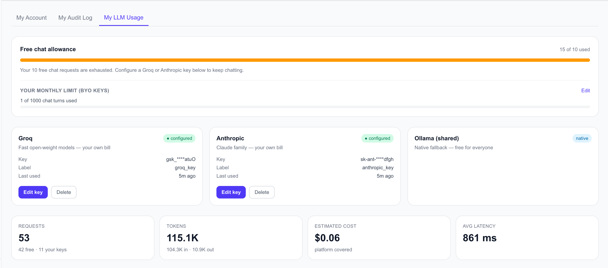
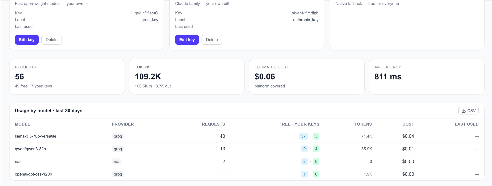

# BYOM — Bring Your Own Model (Chat Agent)

The **Bring-Your-Own-Model** feature lets non-superuser users supply
their own Groq and/or Anthropic API keys. After a per-user free
allowance is exhausted, the chat cascade routes through the user's
key for the remainder of the turn. Non-chat flows (recommendations,
sentiment, forecast batches) and superusers continue to use the
platform's default keys.

---

## Rules at a glance

| Decision | Choice |
|---|---|
| Scope | Chat agent only. All other flows stay on platform keys. |
| Free allowance | **10 lifetime chat turns** per non-superuser user. |
| After exhaustion | Chat blocks with `HTTP 429` unless a Groq or Anthropic key is configured. |
| Configurable providers | Groq (`gsk_…`), Anthropic (`sk-ant-…`). |
| Ollama | Shared / native — free for everyone when available. Last in the cascade. |
| Superuser behaviour | Never routes BYO; `chat_request_count` never bumps. |
| Per-user cap | User-settable monthly cap on own keys. Default **100 chat turns**. |
| Limit unit | Chat **turns** (not individual LLM calls) per IST calendar month. |
| Key encryption | Fernet — master key in `BYO_SECRET_KEY` env (32-byte URL-safe base64). |

---

## My LLM Usage tab

Admin → **My LLM Usage** (pro + general users only; superuser has
the wider `LLM Observability` tab instead).



Five sections, top to bottom:

1. **Free chat allowance** — progress bar, capped at 10. Banner
   flips once exhausted:
   > *"Your 10 free chat requests are exhausted. Configure a Groq or
   > Anthropic key below to keep chatting."*
   Inline `BYOLimitEditor` (Edit / Save / Cancel) for adjusting
   `byo_monthly_limit`. Separate progress bar shows
   `{byo_month_used} of {limit} chat turns used`.

2. **Provider cards** — three cards:
   - **Groq** (configurable) — masked key preview, optional label,
     relative "last used", Edit / Delete buttons.
   - **Anthropic** (configurable) — same shape.
   - **Ollama (shared)** — native fallback badge, no configuration.

3. **KPI cards** — Requests (with `N free · M your keys` split
   subtitle), Tokens (in/out split), Estimated cost (*platform
   covered*), Avg latency.

4. **Usage by model · last 30 days** — table with Model, Provider
   badge, Requests, Free · Your keys (sky/emerald badge pair), Tokens,
   Cost, Last used. CSV export.

   

5. **Daily trend** — 30-day SVG sparkline of request count.

---

## End-to-end workflow

```text
┌────────────────────────────┐
│ 1. User sends chat turn    │
└─────────────┬──────────────┘
              │
              ▼
┌────────────────────────────┐      role=superuser
│ resolve_byo_for_chat(user) ├─────────────────────► Platform keys (always)
└─────────────┬──────────────┘
              │ role ≠ superuser
              ▼
┌────────────────────────────┐     count < 10
│ chat_request_count ≥ 10?   ├─────────────────────► Platform keys
└─────────────┬──────────────┘                      (bumps counter)
              │ ≥ 10
              ▼
┌────────────────────────────┐     no keys
│ Groq or Anthropic key      ├─────────────────────► HTTP 429
│ configured?                │                      "Configure a Groq
└─────────────┬──────────────┘                       or Anthropic key"
              │ has key(s)
              ▼
┌────────────────────────────┐     over limit
│ byo_month_used ≥ limit?    ├─────────────────────► HTTP 429
└─────────────┬──────────────┘                      "BYO monthly limit
              │ under limit                          reached"
              ▼
┌────────────────────────────┐
│ Redis counter++            │
│ last_used_at bump          │
│ Set BYOContext             │
└─────────────┬──────────────┘
              │
              ▼
┌────────────────────────────┐
│ apply_byo_context(ctx):    │
│   graph.invoke(state)      │──► FallbackLLM._try_model swaps in
│   update_summary(…)        │    ChatGroq(api_key=user_key)
└────────────────────────────┘    key_source="user" on llm_usage
```

`chat_request_count` is **not** bumped when the turn routed through
BYO — the free-allowance display pins at `10 of 10` once a user is
paying their own bill.

---

## Backend architecture

### Storage

- **Users table** — two new columns:
  - `chat_request_count INT NOT NULL DEFAULT 0`
  - `byo_monthly_limit INT NOT NULL DEFAULT 100`
- **`user_llm_keys` table** (Alembic `f8e7d6c5b4a3`):
  - `(user_id, provider)` unique
  - `encrypted_key BYTEA` (Fernet ciphertext)
  - `label`, `last_used_at`, `request_count_30d`
  - FK cascade on user delete

### Encryption

`backend/crypto/byo_secrets.py`:

- `get_fernet()` — lazy singleton, fail-fast on missing /
  invalid `BYO_SECRET_KEY`.
- `encrypt_key(plaintext: str) -> bytes`,
  `decrypt_key(ciphertext: bytes) -> str`.
- `mask_key(plaintext: str) -> str` — provider-aware preview
  (`gsk_****abcd`, `sk-ant-****wxyz`).

Plaintext keys are **never** returned from any endpoint — only
masked previews leave the server.

### ContextVar-driven routing

`backend/llm_byo.py`:

- `BYOContext` dataclass — `{user_id, groq_key, anthropic_key}`.
- Module-level `ContextVar[BYOContext | None]`.
- `apply_byo_context(ctx)` context manager — scoped to a chat turn,
  auto-clears on exit.
- `resolve_byo_for_chat(...)` — decides per turn; raises `429`
  when the user must BYO but can't (no keys) or has exhausted
  their own cap.
- Redis counter `byo:month_counter:{user_id}:{yyyy-mm}` — IST
  calendar month, 40-day TTL for safety.
- Fire-and-forget `last_used_at` bump on the providers about to
  be exercised (so chat latency isn't impacted).

### Cascade override

`FallbackLLM._try_model` (Groq path) and the Anthropic fallback
both check `get_active_byo_context()`. When the matching key is
present, they:

1. Build a user-keyed client via
   `get_user_groq_client(key, model, temperature)` /
   `get_user_anthropic_client(...)` — cached on
   `(provider, model, sha256(key)[:12])`.
2. Rebind the stored tools (`_bound_tools` + kwargs captured at
   `bind_tools()` time) so the user-keyed client has identical
   tool shape.
3. Invoke and stamp `key_source="user"` on the
   `ObservabilityCollector.record_request` event.

On any build error (bad key format, connector failure), the code
falls back to the platform client with a warning — chat degrades
gracefully rather than erroring.

### Entry-point wiring

Every chat surface resolves BYO at entry and applies the
ContextVar **inside** the worker thread (see
`shared/debugging/contextvar-run-in-executor` — `run_in_executor`
does not auto-propagate ContextVars):

- HTTP `/chat`, `/chat/stream`.
- LangGraph `_chat_langgraph`, `_stream_langgraph`.
- WebSocket `_run_graph`, `_run_legacy`.
- Post-chat `update_summary` call is wrapped inside the same
  `apply_byo_context` block so the conversation-summary LLM hop
  also uses the user's keys.

---

## Endpoints

All self-scoped; guarded by `get_current_user` only.

| Method | Path | Purpose |
|---|---|---|
| `GET` | `/v1/users/me/llm-keys` | List configured providers (masked). |
| `PUT` | `/v1/users/me/llm-keys/{provider}` | Upsert key. Body: `{key, label?}`. |
| `DELETE` | `/v1/users/me/llm-keys/{provider}` | Remove key. 204 on success; 404 treated as already-gone by the UI. |
| `PATCH` | `/v1/users/me/byo-settings` | Update `monthly_limit`. |

Plus extended scope-self metrics:

- `GET /v1/admin/metrics?scope=self` now returns:
  - `quota` — `{free_allowance_total: 10, free_allowance_used,
    byo_monthly_limit, byo_month_used}` (clamped display).
  - `providers` — array of `{provider, configured, label,
    masked_key, last_used_at, request_count_30d}` plus Ollama
    as `native: true`.
  - `models` — per-user rollup with `requests_platform` +
    `requests_user` split, tokens, cost, `last_used_at` (ISO
    8601 UTC with `Z`).
  - `daily_trend` — 30-day array of `{date, requests, cost}`.

### Audit events

`BYO_KEY_ADDED`, `BYO_KEY_UPDATED`, `BYO_KEY_DELETED`. Each emits
`actor_user_id == target_user_id` so the pro user sees the event
in their own **My Audit Log**.

---

## Local setup

1. Generate the Fernet master key:

   ```bash
   python -c "from cryptography.fernet import Fernet; print(Fernet.generate_key().decode())"
   ```

2. Add to `.env`:

   ```
   BYO_SECRET_KEY=<output-from-step-1>
   ```

3. Apply the migration:

   ```bash
   docker compose exec -e PYTHONPATH=/app:/app/backend backend alembic upgrade head
   ```

4. Recreate the backend container so `env_file` is re-read:

   ```bash
   docker compose up -d --force-recreate backend
   ```

---

## Out of scope for v1

- OpenAI provider support — only Groq + Anthropic in this release.
- Per-provider monthly limits — single number covers both
  combined.
- Retroactive `key_source` backfill on legacy `llm_usage` rows —
  nulls are treated as `platform` at read time.

---

## Related

- [Auth & RBAC](auth.md) — role model and scope=self|all pattern.
- [Billing](billing.md) — Pro tier upgrade flow that grants
  Admin access where BYOM lives.
